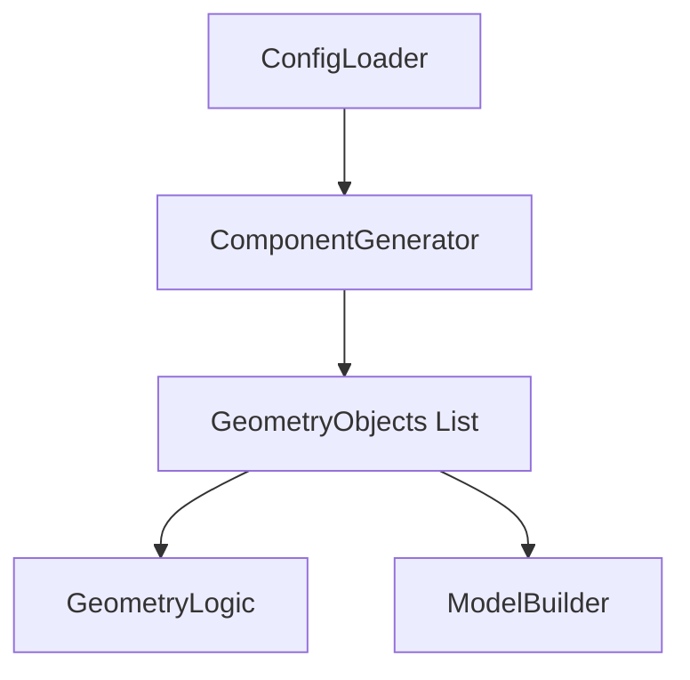

# Technical Design: component-generator

## 1. Overview
本コンポーネントは、密度マップ（mu）を含む各種配置設定を物理的な幾何形状オブジェクトのリストに変換する。
これにより、ROMパラメータ（抽象的な密度）からFVMソルバー（具体的な座標）への厳密な橋渡しを実現する。

### Goals
- 密度ベクトル `mu` を物理的なTSV座標へと正確にデコードする。
- 全シリコン層におけるTSVの垂直アライメントを保証する。
- 最小ピッチおよび境界条件の物理的制約を事前検証する。

### Non-Goals
- チップレイアウト（GDSポリゴン）の変更。
- メッシュ生成アルゴリズムの直接制御。

## 2. Boundary Commitments

### This Spec Owns
- 密度マップからの座標展開ロジック。
- TSVおよびはんだバンプのオブジェクト生成。
- 座標セットの物理的妥当性検証。

### Out of Boundary
- `config-loader` によるJSONパース（入力データの提供）。
- `geometry-logic` による内外判定カーネル。
- `model-builder` によるIDマップ充填処理。

### Allowed Dependencies
- `ConfigLoader.Types`: 設定データ構造。
- `GeometryLogic.Types`: 幾何オブジェクト形式。

## 3. Architecture

### Architecture Pattern & Boundary Map

### Technology Stack
| Layer | Choice / Version | Role in Feature |
|-------|------------------|-----------------|
| Logic | Julia 1.10 | 配置計算・幾何生成 |
| Types | Structs | 幾何プリミティブの抽象化 |

## 4. File Structure Plan

### Directory Structure
- `src/ComponentGenerator/`
  - `ComponentGenerator.jl`: メインエントリポイント。
  - `Layout.jl`: 密度マップ、ランダム、マニュアルの各配置ロジック。
  - `Validator.jl`: 最小ピッチ、境界、禁止領域の検証。
  - `Types.jl`: 内部用データ構造。

## 5. Requirements Traceability

| Requirement | Summary | Components |
|-------------|---------|------------|
| 1.1 | 密度マップからの本数計算 | `Layout.jl` |
| 1.2, 1.3 | $n_{max}$ および $n_{ij}$ 算出 | `Layout.jl` |
| 1.4 | 最大本数マトリックス取得 API | `Layout.jl` |
| 1.5 | Constraint Adjustment (制約調整) | `Layout.jl` |
| 2.1 | セル内格子配置展開 | `Layout.jl` |
| 2.2 | 垂直アライメント保証 | `ComponentGenerator.jl` |
| 3.1, 3.2 | バンプ自動生成と半径算出 | `ComponentGenerator.jl` |
| 4.1, 4.2 | 物理制約（境界・干渉）検証 | `Validator.jl` |
| 5.1 | プリミティブ形式での出力 | `ComponentGenerator.jl` |
| 5.2 | メタデータ追跡 | `Types.jl` |

## 6. Components and Interfaces

### ComponentGenerator
**Intent**: 統合的なコンポーネント生成API。
**Requirements**: 2.2, 3.1, 5.1

- `generate_all_components(config::ModelConfig) -> Vector{GeometryObject}`
  1. `Layout.expand_coordinates` を呼び出し、共通 (x, y) リストを取得。
  2. `Validator.validate_physical_constraints` で干渉等をチェック。
  3. 各層の Z 範囲に合わせて `Cylinder` (TSV) と `Sphere` (Bump) を構築。

### Layout
**Intent**: (x, y) 座標の展開および密度マップの物理的補正。
**Requirements**: 1.1, 1.2, 1.3, 1.4, 1.5, 2.1

- `expand_coordinates(config::TSVConfig) -> Vector{Point2D}`
  - `tsv_mode == "density"` の場合:
    1. セル分割 ($G_x \times G_y$) と各セルの寸法を確定。
    2. 各セルで $n_{max,ij}$ をピッチ制約から算出。
    3. `mu` を適用して $n_{ij}$ 本を格子状に配置。
- `get_cell_capacities(config::TSVConfig) -> Matrix{Int}`
  - 各セル ($G_x \times G_y$) が物理的に収容可能な最大TSV本数 $n_{max,ij}$ を計算して返す。
- `adjust_density_constraints(mu::Vector{Float64}, n_max_matrix::Matrix{Int}, N_limit::Int) -> Vector{Float64}`
  - **Constraint Adjustment (制約調整)**:
    - 各セルの予定本数 $n_{ij} = \text{round}(\mu_{ij} \times n_{max,ij})$ の総和が $N_{limit}$ を超える場合、$\mu$ 全体をスケーリングして総本数を制限内に収める。
    - これは物理的な実行可能性を保証するための「制約調整」であり、学習データの正規化（Data Scaling）とは明確に区別される。

### Validator
**Intent**: 物理的整合性の検証。
**Requirements**: 4.1, 4.2

- `validate_physical_constraints(coords, config)`
  - 最小ピッチ違反の検出。
  - チップ境界逸脱の検出。

## 7. Testing Strategy
- **Unit Tests**:
  - 密度 1.0 の場合に最大本数が正しく配置されるか。
  - セル境界ギリギリの配置で隣接セルと干渉しないか。
  - 密度マップ $\mu$ の変更が本数 $n_{ij}$ に正しく反映されるか。
- **Integration Tests**:
  - `config-loader` からの `mu` を受け取り、最終的なオブジェクトリストが生成されるまでの全工程。
