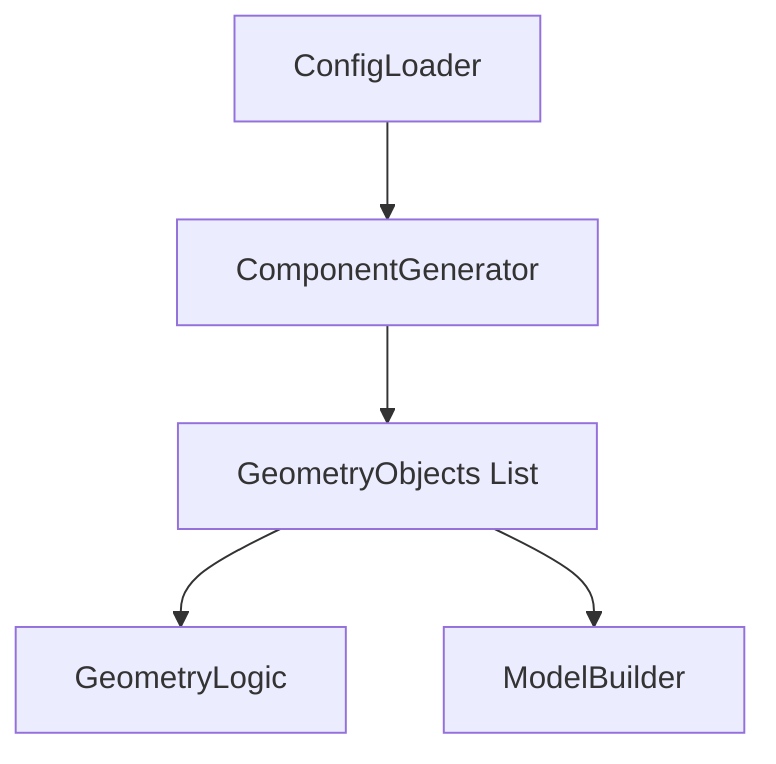

# Technical Design: component-generator

## 1. Overview
本コンポーネントは、密度マップ（mu）を含む各種配置設定を物理的な幾何形状オブジェクトのリストに変換する。
今回の拡張により、TSVの配置可能領域および境界バリデーションの基準をチップ全体（`lx × ly`）から「シリコン実装領域（外周 0.1mm マージンを差し引いた領域）」に制限する。

特に、密度マップから生成する `:density` モードだけでなく、外部の座標データを直接配置する `:manual` モードや `:random` モードなど、実TSV座標をそのまま取り扱う場合におけるシリコン領域外への配置リスクを排除し、シミュレーションモデルの物理的妥当性を保証する。

### Goals
- 密度ベクトル `mu` を物理的なTSV座標へと正確にデコードする。
- すべての配置モード（`:density`, `:manual`, `:random`）において、TSVがシリコン実装領域内に配置されることを保証する。
- TSVの半径を考慮した物理的占有範囲全体が、シリコン実装領域の境界内に収まっていることを厳密に事前検証する。
- 全シリコン層におけるTSVの垂直アライメントを保証する。

### Non-Goals
- GDSII形式ファイルからの動的なシリコン形状ロード（固定の `0.1mm` マージン矩形をシリコン領域の前提とする）。
- チップレイアウト（GDSポリゴン）の変更。
- メッシュ生成アルゴリズムの直接制御。

## 2. Boundary Commitments

### This Spec Owns
- 密度マップからの座標展開ロジックにおけるシリコンマージン（固定 `0.1mm`）の適用。
- すべての配置モードにおける、シリコン実装領域境界に対するTSV座標の事前物理バリデーション。
- TSVおよびはんだバンプのオブジェクト生成。

### Out of Boundary
- `config-loader` によるJSONパース（入力データの提供）。
- `geometry-logic` による内外判定カーネル。
- `model-builder` によるIDマップ充填処理。

### Allowed Dependencies
- `ConfigLoader.Types`: 設定データ構造。
- `GeometryLogic.Types`: 幾何オブジェクト形式。

### Revalidation Triggers
- 境界マージン値（`0.1mm`）の変更。
- シリコン領域が矩形以外（GDS形状等）に変更される場合。

## 3. Architecture

### Existing Architecture Analysis
既存の `ComponentGenerator` は、配置計算（`Layout.jl`）と制約検証（`Validator.jl`）に分かれている。
- `Layout.jl` ではすでに `:density` モード時に `margin = 0.1e-3` を用いてシリコン実装領域への限定を行っている。
- `Validator.jl` では `margin` が考慮されておらず、チップサイズ（`lx`, `ly`）だけを用いてバリデーションが行われていた。
- 本設計では、`Validator.jl` にシリコンマージン `0.1e-3` の判定ロジックを導入することで、すべてのモードにおける物理的整合性を担保する。

### Architecture Pattern & Boundary Map

### Technology Stack
| Layer | Choice / Version | Role in Feature | Notes |
|-------|------------------|-----------------|-------|
| Logic | Julia 1.10 | 配置計算・幾何生成 | 既存スタックの維持 |
| Types | Structs | 幾何プリミティブの抽象化 | 既存スタック of 維持 |

## 4. File Structure Plan

### Directory Structure
`src/ComponentGenerator/` は既存構造を維持する。
- `ComponentGenerator.jl`: メインエントリポイント。
- `Layout.jl`: 密度マップ、ランダム、マニュアルの各配置ロジック。
- `Validator.jl`: 最小ピッチ、境界、禁止領域の検証。
- `Types.jl`: 内部用データ構造。

### Modified Files
- `src/ComponentGenerator/Layout.jl`
  - `:density` モード時におけるシリコンマージン定数 `0.1e-3` を一元管理できるよう準備する（あるいは固定定数として定義）。
  - 各種ドキュメントコメントの更新。
- `src/ComponentGenerator/Validator.jl`
  - `validate_physical_constraints` 内の境界チェック処理において、チェック境界を `radius` から `margin + radius`（`margin = 0.1e-3`）へ更新する。
- `test/test_validator.jl`
  - テストモデルのチップサイズを `lx = 1.2e-3` 等に調整し、シリコンマージン `0.1e-3` を考慮したテスト座標に変更。
  - シリコン実装領域からはみ出した無効な座標が正しく `BOUNDARY_VIOLATION` になることを確認するテストケースを追加。
- `test/test_layout.jl`
  - テストモデルのチップサイズ設定を `lx = 1.2e-3` 基準に整合させ、シリコン内配置の整合性を検証する。

## 5. Requirements Traceability

| Requirement | Summary | Components | Interfaces | Flows |
|-------------|---------|------------|------------|-------|
| 1.1 | 密度マップからの本数計算 | `Layout.jl` | | |
| 1.2, 1.3 | $n_{max}$ および $n_{ij}$ 算出 | `Layout.jl` | | |
| 1.4 | 最大本数マトリックス取得 API | `Layout.jl` | | |
| 1.5 | Constraint Adjustment (制約調整) | `Layout.jl` | | |
| 2.1 | シリコン領域内での格子配置展開 | `Layout.jl` | `expand_coordinates` | |
| 2.2 | 垂直アライメント保証 | `ComponentGenerator.jl` | `generate_components` | |
| 2.3 | 他モード（manual/random）の維持 | `Layout.jl` | `expand_coordinates` | |
| 3.1, 3.2 | バンプ自動生成と半径算出 | `ComponentGenerator.jl` | `generate_components` | |
| 4.1 | シリコン実装領域の境界逸脱検証 | `Validator.jl` | `validate_physical_constraints` | |
| 4.2 | 最小ピッチ検証 | `Validator.jl` | `validate_physical_constraints` | |
| 4.3 | 前処理としての制約検証実行 | `ComponentGenerator.jl` | | |
| 5.1 | プリミティブ形式での出力 | `ComponentGenerator.jl` | | |
| 5.2 | メタデータ追跡 | `Types.jl` | | |

## 6. Components and Interfaces

### ComponentGenerator

#### ComponentGenerator.Main
- **Intent**: 統合的なコンポーネント生成API。
- **Requirements**: 2.2, 3.1, 4.3, 5.1
- **Responsibilities & Constraints**:
  - `generate_components` 実行時、座標展開後に `Validator.validate_physical_constraints` を呼び出し、境界・ピッチに違反がある場合は例外（エラー）を出力して処理を中断する。
- **Dependencies**:
  - Outbound: `Layout.expand_coordinates` (P0), `Validator.validate_physical_constraints` (P0)

### Layout

#### Layout.Main
- **Intent**: 各配置モードに応じた (x, y) 座標の展開。
- **Requirements**: 1.1, 1.2, 1.3, 1.4, 1.5, 2.1, 2.3
- **Responsibilities & Constraints**:
  - シリコンマージン `0.1e-3` (0.1mm) を基準としたシリコン実装領域（`[0.1e-3, lx - 0.1e-3]`）に対してのみセル分割および TSV 格子配置を展開する。
- **Contracts**: Service [x]
  - `expand_coordinates(config::TSVConfig, lx::Float64, ly::Float64) -> Vector{Point2D}`
  - `get_cell_capacities(config::TSVConfig, lx::Float64, ly::Float64) -> Matrix{Int}`

### Validator

#### Validator.Main
- **Intent**: 生成された座標が物理制約を満たしているかの検証。
- **Requirements**: 4.1, 4.2
- **Responsibilities & Constraints**:
  - すべての TSV 座標 (x, y) が、半径 `radius` を加味してシリコン実装領域 `[0.1e-3, lx - 0.1e-3]` 内に完全に収まっていることを検証する。
- **Contracts**: Service [x]
  - `validate_physical_constraints(coords::Vector{Point2D}, config::ModelConfig) -> ValidationResult`
  - 境界違反判定の数式：
    - $x - r < 0.1 \times 10^{-3} \lor x + r > l_x - 0.1 \times 10^{-3}$
    - $y - r < 0.1 \times 10^{-3} \lor y + r > l_y - 0.1 \times 10^{-3}$

## 7. Testing Strategy

### Unit Tests
- **境界チェックの検証 (`test_validator.jl`)**:
  - シリコン領域境界（`0.1mm + radius`）の直内側および直外側に TSV を配置し、バリデーションが正しくパス、または `BOUNDARY_VIOLATION` を返すことを検証する。
  - テストモデルのチップサイズを `lx = 1.2e-3`, `ly = 1.2e-3` とした状態での境界チェックの正常動作。
- **密度マップ配置の検証 (`test_layout.jl`)**:
  - 生成された全座標が `[0.1e-3, lx - 0.1e-3]` のシリコン範囲内に収まっていることを検証する。
