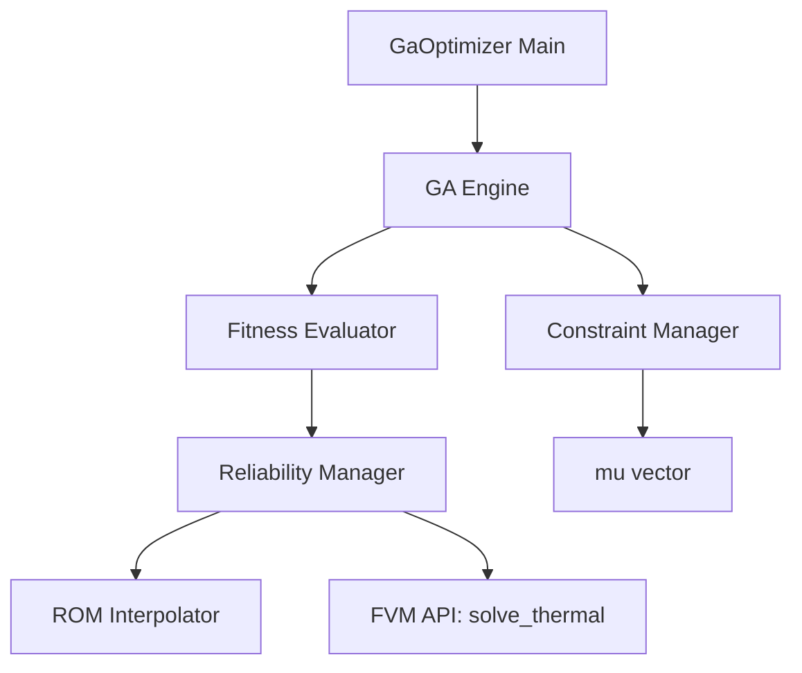

# Technical Design: ga-optimizer

## Overview
本機能は、3D-ICの熱設計において、TSV配置を最適化するための遺伝的アルゴリズム（GA）エンジンを提供します。TSV配置を「密度マップ」として表現し、次数低減モデル（ROM）による高速評価と物理ソルバー（FVM）による高精度検証を組み合わせることで、制約条件を満たしつつ最高温度を最小化する設計案を効率的に探索します。

### Goals
- 密度マップ `mu` を個体とするGA最適化ループの実装。
- 「Constraint Adjustment」プロセスによる、総TSV本数、セル密度、配置禁止領域の制約の自動維持。
- ROMの予測精度が低い領域（外挿）の検知と、上位個体へのFVM再検証フローの構築。
- `ROMInterpolator.get_tmax` を用いた一貫性のある最高温度抽出と適合度評価。
- 最適解に対して「密度マップ → 実TSV座標 → FVM解析」のフローを完遂し、物理的妥当性を証明する。

### Non-Goals
- ROM（POD-RBF）の基底抽出や補間ロジック自体の実装（既存モジュールを利用）。
- FVMソルバーの内部アルゴリズム修正。
- 信号TSVや配線長などの熱以外のパラメータの最適化。

## Boundary Commitments

### This Spec Owns
- 密度マップベクトル `mu` に対するGAオペレータ（交叉、突然変異、選択）。
- `ComponentGenerator.Layout.adjust_density_constraints` を利用した「Constraint Adjustment（制約修正）」ロジック。
- 適合度評価におけるROM/FVMの切り替え・信頼性判定。
- 最適化履歴の管理と最終レポートの出力。

### Out of Boundary
- ROMモデルの永続化とロード（`rom-interpolator` が担当）。
- 密度マップから実TSV座標への幾何学的展開（`component-generator` が担当）。
- FVM解析の並列実行制御（既存の `run.jl` 相当の機能）。

### Allowed Dependencies
- `H2-rom`: ROM評価インターフェース。
- `H2-main-ext`: FVM実行および `component-generator` 機能。
- `Evolutionary.jl` (or similar): GA基盤ライブラリ（カスタムロジックのプラグイン先）。

### Revalidation Triggers
- 密度マップ `mu` のデータ構造変更。
- ROM/FVM呼び出しインターフェースの変更。
- 制約条件の定義（JSONスキーマ）の変更。

## Architecture

### Architecture Pattern & Boundary Map
GAエンジンを中核とし、評価・制約・信頼性の各責務をサービスとして分離する「オーケストレーター・パターン」を採用します。



### Technology Stack

| Layer | Choice / Version | Role in Feature | Notes |
|-------|------------------|-----------------|-------|
| Logic | Julia 1.10+ | コア最適化エンジン | |
| GA Library | Evolutionary.jl (proposed) | GAアルゴリズム基盤 | 必要に応じて自作 |
| Data Storage | JLD2.jl | 最適化履歴・エリート個体の保存 | |
| Integration | JSON3.jl | 最適化パラメータの読み込み | |

## File Structure Plan

### Directory Structure
```
H2-rom/src/GaOptimizer/
├── Types.jl               # 遺伝子(mu), 個体, 最適化状態の型定義
├── Engine.jl              # GAループ、交叉、突然変異、選択の制御
├── ConstraintManager.jl   # 密度マップの正規化、境界チェック
├── ReliabilityManager.jl  # 外挿検知、ROM/FVM呼び出し制御
└── GaOptimizer.jl         # メインエントリ、run_optimization の公開
```

### Modified Files
- `.kiro/steering/tech.md` — 必要に応じてGAライブラリを追記
- `H2-main-ext/src/component_generator.jl` — 密度マップ展開機能の確認（必要なら微修正）
- `H2-main-ext/src/heat3ds.jl` — FVM実行API (`solve_thermal`) の提供元

## Requirements Traceability

| Requirement | Summary | Components | Interfaces | Flows |
|-------------|---------|------------|------------|-------|
| 1.1-1.4 | GA最適化ループ | Engine.jl, Types.jl | IGaEngine | 初期化 -> 評価 -> 進化 |
| 2.1-2.3 | 制約条件管理 | ConstraintManager.jl | IConstraintManager | 各世代での正規化 |
| 3.1-3.3 | 信頼性管理 | ReliabilityManager.jl | IReliabilityManager | 外挿判定, FVM再検証 |
| 4.1-4.3 | 最終解の検証 | GaOptimizer.jl | IGaOptimizer | 最終フローの完遂 |

## Components and Interfaces

### [GaOptimizer Service Layer]

#### GaEngine (Engine.jl)

| Field | Detail |
|-------|--------|
| Intent | GAの進化プロセスを制御する中核コンポーネント |
| Requirements | 1.1, 1.2, 1.3, 1.4 |

**Responsibilities & Constraints**
- 初期個体群の生成（ランダムまたはヒント付き）。
- 進化操作（交叉・突然変異）の適用。
- 適合度に基づく次世代の選択。
- 各操作直後の `ConstraintManager` 呼び出し。

**Contracts**: Service [x] / State [x]

##### Service Interface
```julia
interface IGaEngine {
    function evolve(population: Population): Population;
    function evaluate(individual: mu): Float64;
}
```

#### ConstraintManager (ConstraintManager.jl)

| Field | Detail |
|-------|--------|
| Intent | 「Constraint Adjustment」プロセスにより、密度マップが物理的制約を満たすように修正する |
| Requirements | 2.1, 2.2, 2.3 |

**Responsibilities & Constraints**
- **物理制約の適用**: `ComponentGenerator.Layout.adjust_density_constraints(mu, config)` を呼び出し、交叉や突然変異によって生じた制約違反（総本数超過、セル密度上限、配置禁止領域）を修正する。
- **メタデータの同期**: `config-loader` が提供する制約設定（$N_{max}$, $\rho_{cell,max}$, forbidden_zones）を `adjust_density_constraints` に確実に引き渡す。

#### ReliabilityManager (ReliabilityManager.jl)

| Field | Detail |
|-------|--------|
| Intent | ROMの予測信頼性を判定し、必要に応じてFVMに切り替える |
| Requirements | 3.1, 3.2, 3.3 |

**Responsibilities & Constraints**
- `ROMInterpolator.is_reliable(model, mu)` を使用した入力 `mu` の信頼性判定。
- `ROMInterpolator.get_tmax(model, mu)` を使用した、ROM予測値からの最高温度抽出。
- 外挿個体に対するペナルティ付与またはFVM実行の判定。
- エリート個体に対するFVM再検証の実行（`H2-main-ext` の `solve_thermal(mu)` を直接呼び出し）。

**Contracts**: Service [x]

##### Service Interface
```julia
interface IReliabilityManager {
    function get_fitness(mu: mu): Float64; # ROM/FVMを使い分け
    function is_reliable(mu: mu): Bool;    # ROMInterpolator.is_reliable をラップ
    function solve_thermal_fvm(mu: mu): Float64; # H2-main-ext の API を呼び出し
}
```

## Data Models

### Domain Model
- **Genotype (`mu`)**: セルごとの密度値を保持するベクトル。
- **Individual**: `mu` と、それに対応する `fitness` (最高温度), `is_fvm_verified` フラグ、外挿スコアのセット。
- **OptimizationState**: 現在の世代、最良個体、個体群、収束履歴。

## Testing Strategy

### Unit Tests
- `ConstraintManager` のテスト: 様々な違反パターン（総数超過、範囲外、禁止領域）が正しく修正されるか。
- GAオペレータのテスト: 交叉・突然変異が期待通りベクトルに作用するか。
- 外挿検知のテスト: 既知の範囲内外の `mu` に対して正しくフラグが立つか。

### Integration Tests
- ROM連携テスト: ダミーROMインターフェースを用いたGAループの完走。
- 最終検証フローテスト: 密度マップからFVM実行、レポート出力までの一連の動作。

### E2E Tests
- 実際の `config.json` を用いた小規模（少ない世代数）な最適化実行と結果の妥当性確認。
