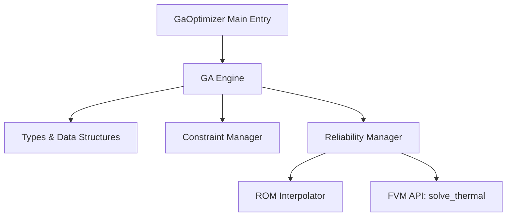
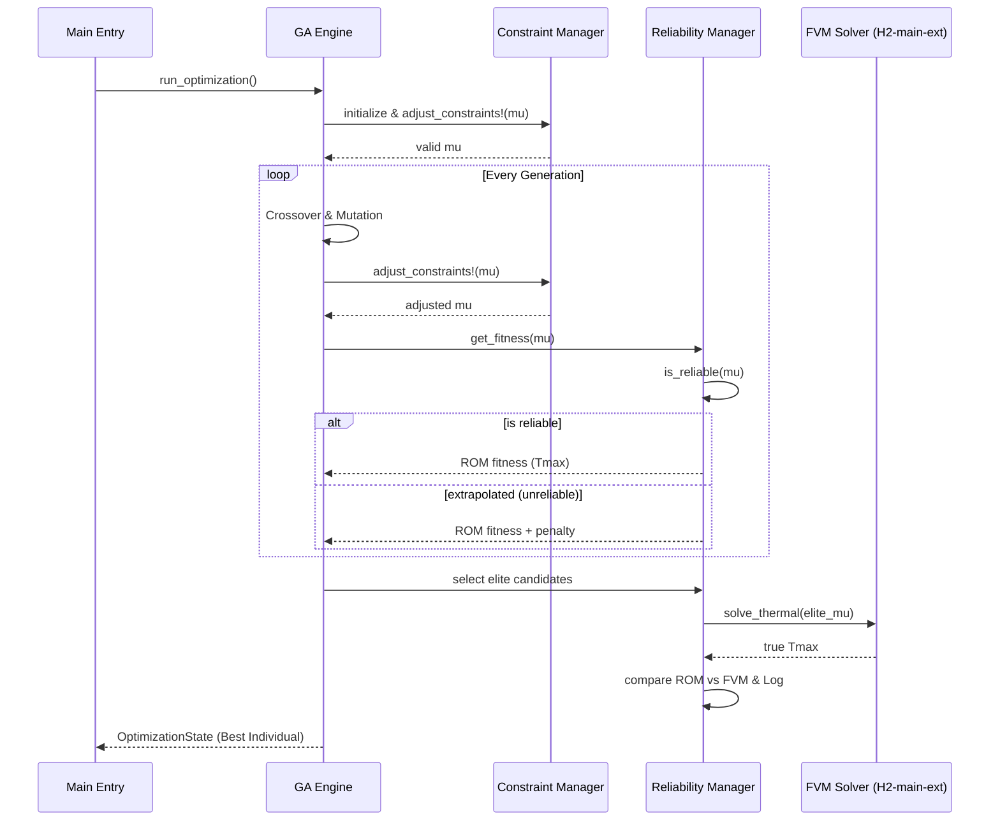

# Technical Design: ga-optimizer

## Overview
本機能は、3D-ICの熱設計において、TSV（Through-Silicon Via）の配置を最適化するための遺伝的アルゴリズム（GA）エンジンを提供します。TSV配置を「密度マップ」として表現し、次数低減モデル（ROM）による高速評価と、物理ソルバー（FVM）による高精度検証を組み合わせることで、制約条件を満たしつつチップの最高温度を最小化する設計案を効率的に探索します。

### Goals
- 密度マップ `mu` を個体とするカスタムGA最適化ループの実装。
- 「Constraint Adjustment」プロセスによる、総TSV本数、セル密度、配置禁止領域の制約の自動維持。
- 制約適用前に `NaN` や `Inf` などの無効な遺伝情報をフィルタリング・事前リサンプリングする堅牢なエラーガードの実装。
- ROMの予測精度が低い領域（外挿）の検知と、それに対するペナルティ付与またはFVM再検証フローの構築。
- 最適解に対して「密度マップ → 実TSV座標展開 → FVM解析」の最終検証フローを完遂し、物理的妥当性を証明する。

### Non-Goals
- ROM（POD-RBF）の基底抽出や補間ロジック自体の実装（`rom-interpolator` などの既存モジュールを利用）。
- FVMソルバーの内部アルゴリズム修正。
- 信号TSVや配線長（HPWL）など、熱以外のパラメータの最適化。

---

## Boundary Commitments

### This Spec Owns
- 密度マップベクトル `mu` に対するGAオペレータ（交叉、突然変異、選択）。
- `ConstraintManager.jl` における、実行時エラーを防ぐための無効値（`NaN`/`Inf`/全ゼロ）検知および事前リサンプリング（pre-resample）制御。
- `ReliabilityManager.jl` による、ROM予測の信頼性判定およびROM/FVMの切り替え・適合度算出。
- 最適化履歴の管理、および最終世代の最適解に対するFVM再検証レポートの生成。

### Out of Boundary
- ROMモデルの永続化とロード（`rom-interpolator` が担当）。
- 密度マップから実TSV座標への幾何学的展開ロジック（`component-generator` が担当）。
- FVM解析の並列実行などの低レイヤソルバー制御。

### Allowed Dependencies
- `H2-rom`: ROM評価インターフェース（`ROMInterpolator`）。
- `H2-main-ext`: FVM実行（`ConfigLoader`, `ComponentGenerator`, `ModelBuilder` などの機能）。

### Revalidation Triggers
- 密度マップ `mu` のデータ構造や要素数の仕様変更。
- ROM評価API（`ROMInterpolator.get_tmax` / `is_reliable`）のシグネチャ変更。
- 制約条件定義（JSONスキーマ）のスキーマ構造変更。

---

## Architecture

### Architecture Pattern & Boundary Map
GAエンジンを中核とし、評価・制約・信頼性の各責責をモジュールとして分離する「オーケストレーター・パターン」を採用します。外部ライブラリへの過度な依存を避け、制約とGAループの緊密な連携を確保するため、GAエンジンは自作のカスタムロジックとして構成します。



### Technology Stack

| Layer | Choice / Version | Role in Feature | Notes |
|-------|------------------|-----------------|-------|
| Logic | Julia 1.10+ | コア最適化エンジン | 強く型付けされた構造体と関数群 |
| Data Storage | JLD2.jl | 最適化履歴・エリート個体の保存 | |
| Integration | JSON3.jl | 最適化パラメータの読み込み | |

---

## File Structure Plan

### Directory Structure
```
H2-rom/src/GaOptimizer/
├── Types.jl               # 遺伝子(mu), 個体, 最適化状態の型定義
├── Engine.jl              # GAループ、交叉、突然変異、選択の制御
├── ConstraintManager.jl   # 密度マップの正規化、境界チェック、無効値事前排除
├── ReliabilityManager.jl  # 外挿検知、ROM/FVM呼び出し制御
└── GaOptimizer.jl         # メインエントリ、run_optimization の公開
```

### Modified Files
- `H2-rom/src/GaOptimizer/ConstraintManager.jl` — `NaN`/`Inf`/全ゼロ入力に対する事前リサンプリングロジックの追加（実装済み）。
- `H2-rom/src/GaOptimizer/Types.jl` — 最適化で使用するJulia型定義の提供（実装済み）。

---

## System Flows

### GA 最適化 & 検証ループ
以下のフローで世代交代を繰り返し、最終解を選定します。



---

## Requirements Traceability

| Requirement | Summary | Components | Interfaces / Functions | Flows |
|-------------|---------|------------|------------|-------|
| 1.1 | 最適化データ構造定義 | Types.jl | `Individual`, `OptimizationState`, `OptimizationConfig` | 初期化・世代交代 |
| 1.2 | 最適化パラメータロード | ConfigLoader (Ext) | `OptimizationConfig(settings)` | 初期化 |
| 1.3 | GA遺伝操作 | Engine.jl | `crossover`, `mutate!`, `select_next_generation` | 世代交代ループ |
| 1.4 | 適合度記録 & 収束出力 | Engine.jl, GaOptimizer.jl | `run_optimization`, `history` | 世代交代ループ |
| 2.1 | 密度正規化 & 境界制限 | ConstraintManager.jl | `apply_constraints!` | 制約適用 |
| 2.2 | 配置禁止領域の適用 | ConstraintManager.jl | `apply_constraints!` | 制約適用 |
| 2.3 | 無効個体排除 & ガード | ConstraintManager.jl | `adjust_constraints!` (pre-resample) | 制約適用 |
| 3.1 | ROM外挿検知 | ReliabilityManager.jl | `is_reliable` | 適合度評価 |
| 3.2 | エリート個体FVM検証 | ReliabilityManager.jl | `solve_thermal_fvm` | 最適化最終段階 / 中間検証 |
| 3.3 | ROM/FVM誤差警告 | ReliabilityManager.jl | `get_fitness`, `verify_elites` | 最適化最終段階 |
| 4.1 | 最終解のFVM検証フロー | GaOptimizer.jl | `run_final_validation` | 最適化完了後 |
| 4.2 | 実TSV座標展開 | ComponentGenerator (Ext) | `generate_coordinates` | 最終検証 |
| 4.3 | レポート出力 | GaOptimizer.jl | `write_summary_report` | 最適化完了後 |

---

## Components and Interfaces

### [GaOptimizer Service Layer]

#### 1. Data Types (Types.jl)
GAの個体および状態、設定を強固に定義します。

```julia
struct Individual
    mu::Vector{Float64}
    fitness::Float64
    is_fvm_verified::Bool
    extrapolation_score::Float64
end

mutable struct OptimizationState
    generation::Int
    best_individual::Union{Nothing, Individual}
    population::Vector{Individual}
    history::Vector{Float64}
end

struct OptimizationConfig
    n_pop::Int
    n_gen::Int
    cx_rate::Float64
    mut_rate::Float64
    n_elite::Int
end
```

#### 2. ConstraintManager (ConstraintManager.jl)
個体が物理的に有効な TSV 配置となるように調整します。

##### Functions
```julia
"""
`isnan`/`isinf`/`all-zeros` などの無効な `mu` を事前リサンプリングにより排除し、
正規化、境界制限、配置禁止領域のゼロ埋めを適用する。
"""
function adjust_constraints!(mu::Vector{Float64}, config::ModelConfig)::Vector{Float64}
```
*   **Preconditions**: `mu` は `config.tsv.density.gx * config.tsv.density.gy` の要素数を持つ。
*   **Postconditions**: 返される `mu` は `[0.0, rho_cell_max]` の範囲内に収まり、総TSV数が `n_max` 以下であり、かつ `NaN` や `Inf` を含まない有効な状態であることが保証される。

#### 3. ReliabilityManager (ReliabilityManager.jl)
ROMとFVMソルバーの切り替えおよび予測モデルの信頼性を管理します。

##### Functions
```julia
"""
ROMモデルの訓練範囲外(外挿領域)にあるかを判定する。
"""
function is_reliable(model::ROMModel, mu::Vector{Float64})::Bool

"""
個体の適合度を算出する。通常はROMを利用し、外挿判定時はペナルティ付きの適合度、
あるいはFVM再検証を起動して真の最高温度を取得する。
"""
function get_fitness(mu::Vector{Float64}, model::ROMModel, config::ModelConfig)::Float64

"""
FVMソルバーを呼び出して実際の熱解析を実行し、最高温度を返す。
"""
function solve_thermal_fvm(mu::Vector{Float64}, config::ModelConfig)::Float64
```

#### 4. GA Engine (Engine.jl)
GAの進化サイクルを制御します。

##### Functions
```julia
"""
制約を満たす初期個体群をランダム生成する。
"""
function initialize_population(config::OptimizationConfig, model_config::ModelConfig)::Vector{Individual}

"""
ブレンド交叉（BLX-α）などを適用し、生成直後に ConstraintManager を通して子個体を制約適合させる。
"""
function crossover(parent1::Individual, parent2::Individual, config::OptimizationConfig, model_config::ModelConfig)::Tuple{Individual, Individual}

"""
ガウス突然変異などを適用し、変異直後に ConstraintManager を通して個体を制約適合させる。
"""
function mutate!(ind::Individual, config::OptimizationConfig, model_config::ModelConfig)::Individual

"""
エリート保存とトーナメント選択を組み合わせて次世代の個体群を選定する。
"""
function select_next_generation(state::OptimizationState, config::OptimizationConfig)::Vector{Individual}
```

---

## Data Models
- **Genotype (`mu`)**: 各セルの密度値を保持する実数ベクトル (`Vector{Float64}`)。
- **Individual**: `mu` と適合度、FVM検証フラグ、外挿スコアを含むイミュータブルなデータ構造。
- **OptimizationState**: 世代数、最良個体、個体群、収束履歴を保持するミュータブルな状態。

---

## Error Handling

### 堅牢性ガード（ConstraintManager）
突然変異や交叉の計算バグなどによって `NaN` や `Inf` が発生した場合、または要素がすべて極小値（`1e-9` 未満）となった場合、これらは無効（`is_invalid`）とみなされます。
無効な個体が検出された場合、制約適用ロジック（`apply_constraints!`）を呼び出す前に、要素を `[0.0, rho_cell_max]` の乱数で一括リサンプリングしてから適用することで、クラッシュ（`InexactError`）を未然に防止します。

### ソルバー実行タイムアウト / 失敗
FVMソルバー（`solve_thermal`）の呼び出しが失敗した、もしくはタイムアウトした場合は、適合度を `Inf`（ペナルティ）として設定し、最適化ループが停止するのを防ぎます。

---

## Testing Strategy

### Unit Tests
- **ConstraintManager のテスト** ([test_constraint_manager.jl](file:///home/somadwsl/somad_dev3/H2-rom/test/test_constraint_manager.jl))
  - 通常の制約適用が正しく動作すること。
  - `NaN` や `Inf` が入力された場合、および全要素が `0.0` になった場合に、クラッシュせず正常に事前リサンプリングされ、有効な密度マップが出力されること。
- **データ構造のテスト** ([test_ga_types.jl](file:///home/somadwsl/somad_dev3/H2-rom/test/test_ga_types.jl))
  - `Individual`, `OptimizationState`, `OptimizationConfig` が定義通りの型安全性を持つこと。
- **GAオペレータのテスト**
  - 交叉（`crossover`）および突然変異（`mutate!`）が正しく適用され、生成後の個体が制約を満たしていること。

### Integration / E2E Tests
- **ROM/FVM連携テスト**
  - ダミーのROMモデルを用いて、外挿判定およびペナルティ計算が動作し、GAが世代数分完走すること。
- **最終検証フローの検証**
  - 最適化で選出された最良解から、実座標データ（TSV配置）への展開、FVMソルバーによる解析、および検証レポート出力までの一連のフローが正常に動作すること。
