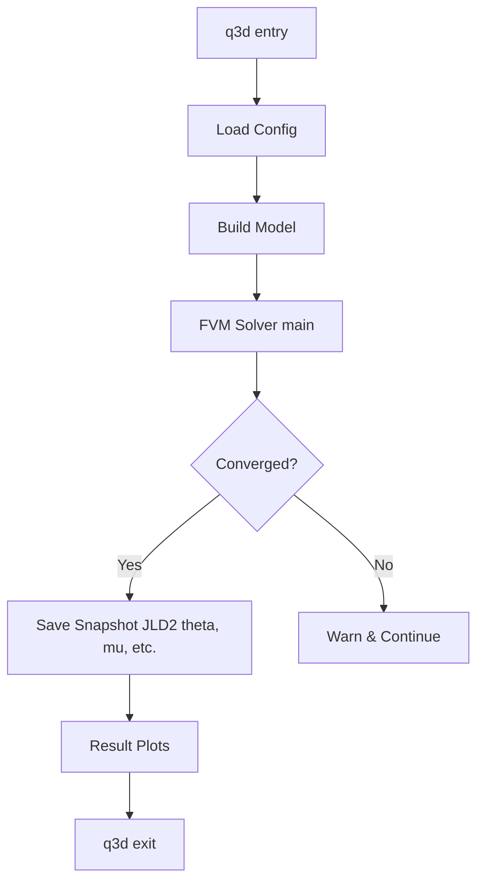

# Technical Design: heat3ds-ext

## Overview
本機能は、FVMソルバー（`heat3ds.jl`）に対し、解析結果を ROM 構築に適したバイナリ形式（JLD2）で保存する機能を拡張します。特に、データ追跡性（自己記述性）を確保するため、温度場 $\theta$ と同時に入力パラメータである密度マップ `mu` を保存することを重視します。

### Goals
- 収束した3次元温度場 $\theta$ を JLD2 形式で保存する。
- 保存ファイルに、シミュレーションで使用された密度マップベクトル `mu` を含める。
- コマンドライン引数や外部からの呼び出しにより、保存パスを動的に指定可能にする。
- 既存の出力（ログ、画像、CSV）を損なわない。

### Non-Goals
- `heat3ds.jl` の物理計算コアアルゴリズムの変更。
- スナップショットのファイル名生成ロジック（`snapshot-generator` が担当）。

## Boundary Commitments

### This Spec Owns
- `q3d` 関数および `main` 関数周辺への JLD2 保存ロジックの統合。
- `mu` パラメータを保存対象に含めるためのデータフロー拡張。
- 書き込み失敗時のエラーハンドリング（例外キャッチと続行）。

### Out of Boundary
- 保存された JLD2 ファイルの読み込みと POD 解析（`pod-engine` が担当）。
- 密度マップから実座標への展開処理（`component-generator` が担当）。

## Architecture

### Integration Point
`heat3ds.jl` の `q3d` 関数内で、シミュレーション終了後、可視化処理の直前または直後に保存処理を挿入します。

### Technology Stack
- **Language**: Julia 1.10+
- **Library**: `JLD2.jl` (シリアライズ用)

## File Structure Plan

### Modified Files
- `H2-main-ext/src/heat3ds.jl`: `q3d` 関数のシグネチャ拡張および保存ロジックの追加。

## Data Models

### JLD2 Snapshot Schema
保存される JLD2 ファイルには以下のキーを含めます。
- `theta`: `Array{Float64, 3}` (3次元温度場)
- `mu`: `Vector{Float64}` (入力密度マップ、存在する場合)
- `id_map`: `Array{UInt8, 3}` (材料IDマップ)
- `metadata`: `Dict` (格子サイズ、物理寸法、収束情報等)

## Requirements Traceability

| Requirement | Summary | Components |
|-------------|---------|------------|
| 1.1 | 温度場 $\theta$ の保存 | `q3d` (heat3ds.jl) |
| 1.2 | 3次元次元の維持 | `JLD2.save` |
| 1.3 | 密度マップ `mu` の保存 | `q3d` (heat3ds.jl) |
| 2.1 | 保存パスの指定 | `q3d` arguments |
| 2.2 | パス未指定時のスキップ | `if !isempty` check |
| 3.1 | 既存プロセスとの互換性 | 位置調整 |
| 3.2 | 書き込みエラーハンドリング | `try-catch` block |

## Testing Strategy
- **Integration Test**: `snapshot-generator` から `mu` と `snapshot_path` を渡して `q3d` を呼び出し、ファイルが生成され、`mu` と `theta` が正しく格納されているか確認する。
