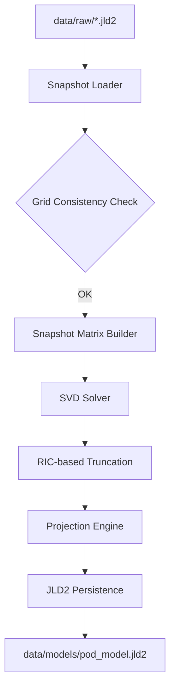

# Design Document: pod-engine

## Overview
`pod-engine` は、高次元の温度場スナップショット群から次数低減モデル（ROM）の空間基底を抽出するためのコンポーネントである。特異値分解（SVD）を用いて支配的なモードを特定し、元の温度場を少数のモーダル係数で表現することを可能にする。

### Goals
- 複数の `.jld2` スナップショットからスナップショット行列を効率的に構築する。
- SVDを実行し、累積寄与率（RIC）に基づく最適な基底数を自動決定する。
- 各スナップショットを基底空間へ射影し、POD係数を算出する。
- 基底データ、平均場、および係数を後続の `rom-interpolator` が利用可能な形式で保存する。

### Non-Goals
- パラメータ（密度マップ `mu`）との紐付けロジック（`rom-interpolator` の責務）。
- 温度場の再構成プロット（`rom-validator` または `validation-plot` の責務）。
- スナップショットの生成そのもの。

## Boundary Commitments

### This Spec Owns
- `data/raw/*.jld2` からのデータ読み込みと格子整合性バリデーション。
- スナップショット行列の構築と平均場（Mean field）の計算。
- SVDの実行と、RICしきい値に基づく基底選択。
- POD基底への射影による係数行列の算出。
- `data/models/pod_model.jld2` への結果の永続化。

### Out of Boundary
- スナップショット生成用のサンプリング戦略。
- RBF等を用いた係数の補間。
- モデルの予測精度評価。

### Allowed Dependencies
- `LinearAlgebra`: SVD計算用。
- `JLD2`: ファイルの読み書き。
- `Statistics`: 平均計算用。

### Revalidation Triggers
- スナップショットファイル（`.jld2`）の内部スキーマ変更。
- 基底データの保存形式（メタデータ構造）の変更。

## Architecture

### Architecture Pattern
- **Pipeline Pattern**: 順次処理によるバッチ抽出プロセス。



### Technology Stack
| Layer | Choice | Role |
|-------|--------|------|
| Core Logic | Julia | 数値計算および行列操作 |
| Math | `LinearAlgebra.jl` | SVD (`svd`) の実行 |
| Storage | `JLD2.jl` | 基底・係数データのシリアライズ |

## File Structure Plan

### Directory Structure
```
H2-rom/
├── src/
│   └── PODEngine/
│       ├── PODEngine.jl     # メインモジュール・エントリ
│       ├── types.jl         # データ構造定義 (PODModel 等)
│       ├── loader.jl        # スナップショット読み込み・バリデーション
│       └── solver.jl        # SVD計算・射影ロジック
└── test/
    └── test_pod_engine.jl   # ユニットテスト
```

## Requirements Traceability

| Requirement | Summary | Components | Interfaces |
|-------------|---------|------------|------------|
| 1.1 | スナップショット行列の構築 | `SnapshotLoader` | `load_snapshots` |
| 1.2 | データ整合性チェック | `SnapshotValidator` | `validate_grids` |
| 2.1 | SVDによるPOD基底抽出 | `SVDSolver` | `compute_svd` |
| 2.2 | RICに基づく基底数決定 | `SVDSolver` | `truncate_modes` |
| 2.3 | デフォルトRIC (0.999) | `SVDSolver` | `truncate_modes` |
| 3.1 | POD係数の算出 (射影) | `ProjectionEngine` | `project_snapshots` |
| 4.1 | 結果の永続化 (.jld2) | `ModelSaver` | `save_pod_model` |
| 4.2 | メタ情報の保存 | `ModelSaver` | `save_pod_model` |

## Components and Interfaces

### PODEngine

#### SVDSolver
| Field | Detail |
|-------|--------|
| Intent | スナップショット行列からPOD基底を抽出し、RICに基づいて縮退させる。 |
| Requirements | 2.1, 2.2, 2.3 |

**Service Interface**
```julia
function compute_pod(X::AbstractMatrix; ric_threshold::Float64=0.999)
    # returns (Ur, Sr, Vr_coeffs, mean_field)
end
```

#### SnapshotLoader
| Field | Detail |
|-------|--------|
| Intent | ディレクトリ内のJLD2ファイル群を読み込み、格子整合性を確認した上で行列化する。スナップショットIDおよびパラメータベクトル（mu）も併せて収集する。 |
| Requirements | 1.1, 1.2 |

**Service Interface**
```julia
function load_snapshot_matrix(dir_path::String)
    # returns Matrix, snapshot_ids, mu_vectors, grid_info
end
```

## Data Models

### PODModel (JLD2 Schema)
- `basis`: `Matrix{Float64}` (POD基底 $U_r$)
- `singular_values`: `Vector{Float64}` ($\Sigma_r$)
- `coefficients`: `Matrix{Float64}` (射影された係数 $A$)
- `mean_field`: `Vector{Float64}` (平均温度場 $\bar{\theta}$)
- `snapshot_ids`: `Vector{String}` (学習に使用したスナップショットの識別子)
- `mu_vectors`: `Matrix{Float64}` (各スナップショットに対応するパラメータベクトル $\mu$)
- `metadata`: `Dict`
    - `ric_threshold`: `Float64`
    - `n_modes`: `Int` (選択された基底数 $r$)
    - `trained_snapshot_ids`: `Vector{String}` (データリーク防止のための学習済みIDリスト)
    - `grid`: `Dict`
        - `dims`: `(nx, ny, nz)`
        - `spacing`: `(dx, dy, dz)`
        - `physical_size`: `(lx, ly, lz)`

## Testing Strategy
- **Unit Tests**:
    - `load_snapshot_matrix`: ダミーのスナップショットファイルを作成し、正しく行列化されるか確認。
    - `compute_pod`: 既知の直交行列を用いたSVD結果の妥当性確認。
    - `RIC計算`: 特異値分布から正しい累積寄与率が計算され、モード数が選択されるか確認。
- **Integration Tests**:
    - 実際に `data/raw/` にある少数のサンプルファイルを用いて、一連のパイプライン（Load -> SVD -> Save）がエラーなく完了することを確認。
