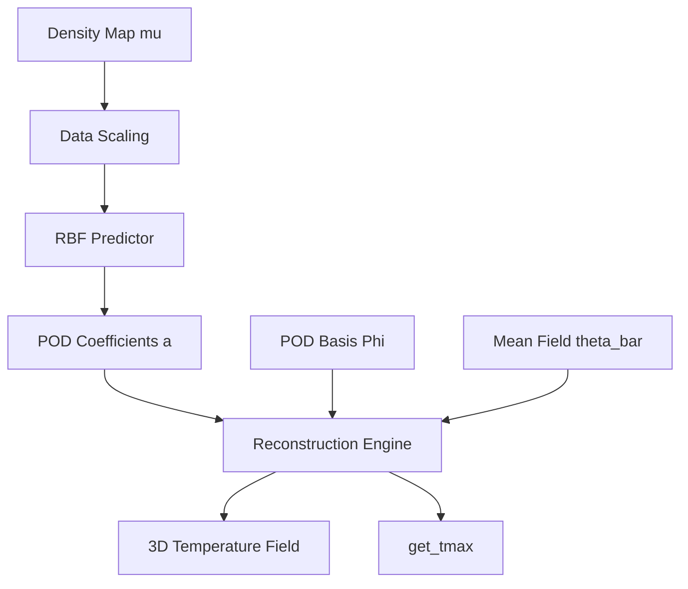

# Design Document: rom-interpolator

## Overview
`rom-interpolator` は、密度マップベクトル $\mu$ を入力とし、次数低減モデル（ROM）のPOD係数 $a$ を予測するためのコンポーネントである。放射基底関数（RBF）を用いた非線形補間により、未知の幾何学的パラメータ（TSV密度）に対する温度場を瞬時に再構成する。

### Goals
- 密度マップ $\mu$ からPOD係数 $a$ への写像を学習する。
- 未知の $\mu$ に対してPOD係数を高速に予測する。
- 予測された係数とPOD基底を組み合わせ、3次元温度場を再構成する。
- 学習済みモデル（RBF重みおよびデータスケーリング（Data Scaling）パラメータ）を永続化する。

### Non-Goals
- POD基底の抽出（`pod-engine` の責務）。
- スナップショットの生成。
- 予測結果の統計的バリデーション（`rom-validator` の責務）。

## Boundary Commitments

### This Spec Owns
- 密度マップ $\mu$ のデータスケーリング（Data Scaling）ロジック。
- RBFモデルの学習（重み行列の算出）。
- 学習済みモデルの保存・読み込み（`rom_model.jld2`）。
- 入力 $\mu$ に対する係数予測および温度場ベクトルの合成（再構成）。
- 再構成された温度場の 3D グリッド形状への変換および最高温度の抽出（`get_tmax`）。

### Out of Boundary
- GAによる最適化ループそのもの。
- 密度マップから実TSV座標への展開。

### Allowed Dependencies
- `LinearAlgebra`: RBFの重み計算（最小二乗法）および再構成（行列・ベクトル積）用。
- `JLD2`: モデルの保存。
- `pod-engine`: 学習データ（POD係数）および予測時のPOD基底のソース。

### Revalidation Triggers
- POD基底データの構造変更。
- 密度マップの定義（グリッド解像度等）の変更。

## Architecture

### Architecture Pattern
- **Mapping & Reconstruction Pattern**: 入力パラメータ空間から低次元係数空間への写像と、その後の物理空間への復元。



### Technology Stack
| Layer | Choice | Role |
|-------|--------|------|
| Prediction | Julia | RBF補間および行列演算 |
| Storage | `JLD2.jl` | 学習済みRBF重みの保存 |
| Math | `LinearAlgebra.jl` | `\` 演算子による重み算出 |

## File Structure Plan

### Directory Structure
```
H2-rom/src/ROMInterpolator/
├── ROMInterpolator.jl    # メインモジュール・エントリ
├── types.jl              # RBFModel, ScalingParams 等の定義
├── rbf.jl                # RBF学習・予測ロジック
└── reconstructor.jl      # 温度場再構成ロジック
```

## Requirements Traceability

| Requirement | Summary | Components | Interfaces |
|-------------|---------|------------|------------|
| 1.1 | RBFモデルの学習 | `RBFEngine` | `train_rbf` |
| 1.2 | 進捗・ステータス表示 | `RBFEngine` | `train_rbf` |
| 1.3 | 入力バリデーション | `RBFEngine` | `train_rbf` |
| 2.1 | 密度マップのデータスケーリング | `DataScaler` | `scale_data`, `fit_scaler` |
| 2.2 | 予測時のスケーリング適用 | `DataScaler` | `scale_data` |
| 3.1 | POD係数の予測 | `RBFEngine` | `predict_coeffs` |
| 3.2 | 温度場の再構成 | `Reconstructor` | `reconstruct_field` |
| 3.3 | 3Dグリッド形状への変換 | `Reconstructor` | `reshape_to_3d` |
| 3.4 | 最高温度の抽出 | `Reconstructor` | `get_tmax` |
| 4.1 | モデルの永続化 | `ROMModelSaver` | `save_rom_model` |
| 4.2 | モデルの復元 | `ROMModelSaver` | `load_rom_model` |
| 5.1 | 外挿検知（信頼性評価） | `ReliabilityGuard` | `is_reliable` |

## Components and Interfaces

### ROMInterpolator

#### RBFEngine
| Field | Detail |
|-------|--------|
| Intent | スケーリングされた密度マップからPOD係数への写像を管理する。 |
| Requirements | 1.1, 1.3, 3.1 |

**Service Interface**
```julia
# 学習
function train_rbf(mu_matrix::Matrix{Float64}, coeff_matrix::Matrix{Float64}; lambda=1e-6)
    # mu_matrix: (N_dim, N_samples), coeff_matrix: (N_modes, N_samples)
    # returns RBFWeights
end

# 予測
function predict_coeffs(weights::RBFWeights, mu_new::Vector{Float64})
    # returns a_new
end
```

#### ReliabilityGuard
| Field | Detail |
|-------|--------|
| Intent | 入力パラメータが学習データの凸包（または境界範囲）に収まっているかを確認し、信頼性を評価する。 |
| Requirements | 5.1 |

**Service Interface**
```julia
# 信頼性判定
function is_reliable(model::RBFModel, mu::Vector{Float64})::Bool
    # mu の各要素が model.parameter_bounds 内にあるか確認
end
```

#### DataScaler
| Field | Detail |
|-------|--------|
| Intent | 入力ベクトルの各次元を $[0, 1]$ などの範囲に数値的に正規化（スケーリング）する。 |
| Requirements | 2.1, 2.2 |

**Strategy**
密度マップ $\mu$ の各要素は元々密度（比率）であるが、特定のセルが常に 0 に近い、あるいは 1 に近いといった統計的偏りがある場合、RBF カーネルの距離計算が不安定になる可能性がある。そのため、`DataScaler` は学習データセットにおける各セルの最小値と最大値を基準として、**全パラメータを $[0, 1]$ の範囲に再スケーリング（Min-Max Scaling）**する。これにより、すべての入力次元が補間モデルにおいて平等な寄与を持つようにする。物理レイヤーでの制約調整（Constraint Adjustment）とは明確に区別し、純粋な数値計算上の正規化として扱う。

**Service Interface**
```julia
function fit_scaler(data::Matrix{Float64})
    # 各次元の min, max を算出
end

function scale_data(data::AbstractVecOrMat, params::ScalingParams)
    # スケーリング実行
end
```

#### Reconstructor
| Field | Detail |
|-------|--------|
| Intent | POD係数と基底から温度場を復元し、指定の形状に整え、最高温度などの指標を抽出する。 |
| Requirements | 3.2, 3.3, 3.4 |

**Service Interface**
```julia
function reconstruct_field(coeffs::Vector{Float64}, basis::Matrix{Float64}, mean_field::Vector{Float64})
    # theta = mean_field + basis * coeffs
end

function get_tmax(theta::Vector{Float64})::Float64
    # return maximum(theta)
end
```

## Data Models

### RBFModel (JLD2 Schema)
- `weights`: `Matrix{Float64}` (RBF重み $W$)
- `centers`: `Matrix{Float64}` (学習データの $\mu$ )
- `scaling_params`: `ScalingParams` (min, max 等)
- `parameter_bounds`: `Matrix{Float64}` (各次元の最小値・最大値 $[min; max]$ )
- `kernel_params`: `Dict` (kernel_type, epsilon 等)

## Testing Strategy
- **Unit Tests**:
    - `DataScaler`: 既知のデータに対して正しく $[0, 1]$ に変換されるか。
    - `RBFEngine`: 学習データそのものを入力した際に、誤差が許容範囲内（正則化なしならほぼ0）か。
    - `Reconstructor`: 既知の係数と基底から、期待されるベクトルが生成されるか。`get_tmax` が正しく動作するか。
- **Integration Tests**:
    - `pod-engine` で生成された `pod_model.jld2` を読み込み、学習から再構成までの一連のフローが正常に動作することを確認。
