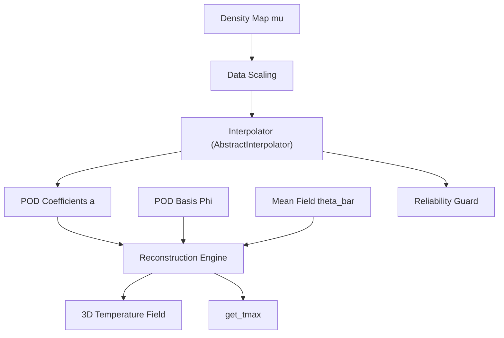

# Design Document: rom-interpolator

## Overview
`rom-interpolator` は、密度マップベクトル $\mu$ を入力とし、次数低減モデル（ROM）のPOD係数 $a$ を予測するためのコンポーネントである。補間アルゴリズムは抽象化インターフェースを介して拡張可能に設計され、デフォルトでガウスカーネルを用いた放射基底関数（RBF）補間を提供する。これにより、未知の幾何学的パラメータ（TSV密度）に対する温度場を高速に再構成する。

### Goals
- 密度マップ $\mu$ からPOD係数 $a$ への写像を学習する抽象インターフェース `AbstractInterpolator` を提供する。
- 具象補間手法として RBF 補間モデル (`RBFInterpolator`) をデフォルトで実装する。
- 未知の $\mu$ に対してPOD係数を高速に予測し、POD基底と組み合わせて 3D 温度場を再構成する。
- 学習済みモデル（補間重みおよびデータスケーリングパラメータ）を永続化する。
- パラメータの外挿状態（信頼性）を判定する拡張可能なガード機構を提供する。

### Non-Goals
- POD基底の抽出（`pod-engine` の責務）。
- スナップショットの生成。
- 予測結果の統計的バリデーション（`rom-validator` の責務）。

## Boundary Commitments

### This Spec Owns
- 抽象インターフェース `AbstractInterpolator` の定義および RBF による具象実装。
- 密度マップ $\mu$ のデータスケーリング（Min-Max Scaling）ロジック。
- 学習済みモデルの保存・読み込み（JLD2 形式）。
- 入力 $\mu$ に対する係数予測および温度場ベクトルの合成（再構成）。
- 再構成された温度場の 3D グリッド形状への変換および最高温度の抽出（`get_tmax`）。
- 拡張可能な信頼性判定（外挿検知）API。

### Out of Boundary
- GAによる最適化ループそのもの。
- 密度マップから実TSV座標への展開。

### Allowed Dependencies
- `LinearAlgebra`: 最小二乗法による重み計算、および行列・ベクトル積による温度場再構成。
- `JLD2`: モデルの保存・復元。
- `pod-engine`: 学習データ（POD係数）および予測時のPOD基底のソース。

### Revalidation Triggers
- POD基底データの構造変更。
- 密度マップの定義（グリッド解像度等）の変更。

## Architecture

### Architecture Pattern
- **Abstract Factory / Interface Pattern**: 補間アルゴリズムと判定器の抽象化。
- **Mapping & Reconstruction Pattern**: パラメータ空間から低次元係数空間への写像と、物理空間への復元。



### Technology Stack
| Layer | Choice | Role |
|-------|--------|------|
| Prediction | Julia | 抽象インターフェース設計、RBF補間、行列演算 |
| Storage | `JLD2.jl` | 学習済み補間モデルの永続化保存 |
| Math | `LinearAlgebra.jl` | 重み算出のための最小二乗法演算および行列・ベクトル積 |

## File Structure Plan

### Directory Structure
```
H2-rom/src/ROMInterpolator/
├── ROMInterpolator.jl    # メインモジュール・エントリ
├── types.jl              # 抽象型、具象補間モデル、スケーリングパラメータの定義
├── interpolator.jl       # RBF等の補間学習・予測実装
└── reconstructor.jl      # 温度場再構成ロジック
```

## Requirements Traceability

| Requirement | Summary | Components | Interfaces |
|-------------|---------|------------|------------|
| 1.1 | 抽象補間モデルの定義 | `Interpolator` | `AbstractInterpolator` |
| 1.2 | モデルの学習 (fit!) | `Interpolator` | `fit!` |
| 1.3 | 具象 RBF 実装 | `Interpolator` | `RBFInterpolator` |
| 1.4 | 入力バリデーション | `Interpolator` | `fit!` |
| 2.1 | 密度マップのデータスケーリング | `DataScaler` | `scale_data`, `fit_scaler` |
| 2.2 | 予測時のスケーリング適用 | `DataScaler` | `scale_data` |
| 3.1 | POD係数の予測 | `Interpolator` | `predict` |
| 3.2 | 温度場の再構成 | `Reconstructor` | `reconstruct_field` |
| 3.3 | 3Dグリッド形状への変換 | `Reconstructor` | `reshape_to_3d` |
| 3.4 | 最高温度の抽出 | `Reconstructor` | `get_tmax` |
| 4.1 | モデルの永続化 | `ROMModelSaver` | `save_rom_model` |
| 4.2 | モデルの復元 | `ROMModelSaver` | `load_rom_model` |
| 5.1 | 外挿検知（信頼性評価） | `ReliabilityGuard` | `is_reliable` |
| 5.2 | ボックス型外挿検知 (デフォルト) | `ReliabilityGuard` | `is_reliable` |
| 5.3 | 外挿検知アルゴリズムの拡張性 | `ReliabilityGuard` | `is_reliable` |

## Components and Interfaces

### ROMInterpolator

#### Interpolator
| Field | Detail |
|-------|--------|
| Intent | 密度マップからPOD係数への写像の学習・予測のインターフェースおよび具象クラスを管理する。 |
| Requirements | 1.1, 1.2, 1.3, 1.4, 3.1 |

**Service Interface**
```julia
# 抽象補間器定義
abstract type AbstractInterpolator end

# 共通 API: 学習
# fit!(interpolator::AbstractInterpolator, X::Matrix{Float64}, Y::Matrix{Float64})
# - X: 学習用密度マップ (N_dim, N_samples)
# - Y: 学習用POD係数 (N_modes, N_samples)

# 共通 API: 予測
# predict(interpolator::AbstractInterpolator, x::Vector{Float64}) -> Vector{Float64}

# 具象クラス定義 (RBF)
struct RBFInterpolator <: AbstractInterpolator
    weights::Matrix{Float64}
    centers::Matrix{Float64}
    epsilon::Float64
    scaling_params::ScalingParams
    parameter_bounds::Matrix{Float64} # 各次元の最小値・最大値 [min; max] (外挿判定用)
end
```

#### ReliabilityGuard
| Field | Detail |
|-------|--------|
| Intent | 入力されたパラメータが、学習に使用されたデータの範囲内にあるかを判定し信頼性を評価する。判定処理は多重ディスパッチによって定義され、差し替え可能。 |
| Requirements | 5.1, 5.2, 5.3 |

**Service Interface**
```julia
# 信頼性判定
# is_reliable(interpolator::AbstractInterpolator, mu::Vector{Float64})::Bool

# デフォルト実装 (RBFInterpolator に対する Box判定)
# 各セルの mu が interpolator.parameter_bounds [min_i, max_i] に収まっているかを確認
```

#### DataScaler
| Field | Detail |
|-------|--------|
| Intent | 入力ベクトルの各次元を $[0, 1]$ の範囲に Min-Max 正規化（スケーリング）する。 |
| Requirements | 2.1, 2.2 |

**Service Interface**
```julia
function fit_scaler(data::Matrix{Float64}) -> ScalingParams
function scale_data(data::AbstractVecOrMat, params::ScalingParams)
```

#### Reconstructor
| Field | Detail |
|-------|--------|
| Intent | POD係数と基底から温度場を復元し、指定の形状に整え、最高温度などの指標を抽出する。 |
| Requirements | 3.2, 3.3, 3.4 |

**Service Interface**
```julia
function reconstruct_field(coeffs::Vector{Float64}, basis::Matrix{Float64}, mean_field::Vector{Float64})
function get_tmax(theta::Vector{Float64})::Float64
```

## Data Models

### ROMModel (JLD2 Schema)
- 保存対象：`AbstractInterpolator` の具象構造体オブジェクト（`RBFInterpolator` 自体）。
- RBF 保存時の内部構造：
  - `weights`: `Matrix{Float64}`
  - `centers`: `Matrix{Float64}`
  - `epsilon`: `Float64`
  - `scaling_params`: `ScalingParams`
  - `parameter_bounds`: `Matrix{Float64}`
  - `metadata`: `Dict` (kernel_type: "gaussian" 等)

## Testing Strategy
- **Unit Tests**:
  - `DataScaler`: 既知のデータに対して正しく正規化されるか。
  - `AbstractInterpolator`: `RBFInterpolator` で学習した際、自己予測誤差がほぼ 0 になるか。
  - `ReliabilityGuard`: 範囲外（外挿）の `mu` に対して `is_reliable` が期待通り `false` を返し、範囲内なら `true` を返すか。
  - `Reconstructor`: 既知 of 係数・基底から正しい再構成ベクトルが計算されるか。
- **Integration Tests**:
  - `pod-engine` で生成された `pod_model.jld2` をロードして、RBFの学習から予測・再構成までがシームレスに動作し、永続化ファイルを読み書きできることを検証。
