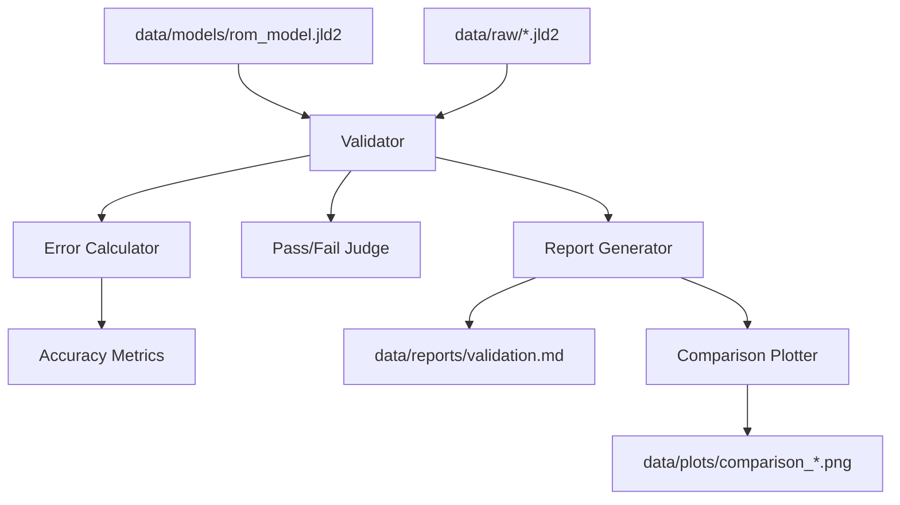

# Design Document: rom-validator

## Overview
`rom-validator` は、構築された次数低減モデル（ROM）の予測精度を、未知の設計パラメータ（密度マップ）に対して定量的に検証するためのコンポーネントである。FVMによる高精度な解析結果（正解データ）とROMの予測結果を比較し、物理的な妥当性と誤差統計を算出する。

### Goals
- 学習に使用されていない検証用スナップショットを自動的に特定し、ロードする。
- 温度場全体の相対L2誤差、Tmax誤差、ホットスポット位置誤差を算出する。
- 精度指標の統計（平均、最大）をまとめ、合格判定（Validated/Unfit）を行う。
- ROM vs FVM の比較プロットおよび誤差マップを生成する。

### Non-Goals
- スナップショットの生成（`snapshot-generator` の責務）。
- ROMの学習（`rom-interpolator` の責務）。
- 最適化ループ内でのリアルタイム評価（本コンポーネントはオフライン検証に特化する）。

## Boundary Commitments

### This Spec Owns
- 検証用データ（Snapshot）と学習済みROM（Model）の整合性チェック。
- 予測温度場と解析温度場の間の数値的誤差計算。
- 精度合格判定基準の適用。
- 評価レポート（JSON/Markdown）および比較プロットの生成。

### Out of Boundary
- ROMの内部アルゴリズム（POD/RBF）の変更。
- スナップショット生成用のサンプリングパラメータの決定。

### Allowed Dependencies
- `PODEngine`: データ構造（PODModel）の再利用。
- `ROMInterpolator`: 予測実行インターフェースの利用。
- `ValidationPlot`: プロット機能の利用（または拡張）。
- `LinearAlgebra`: 誤差ノルム計算。

### Revalidation Triggers
- `PODModel` の内部データ構造の変更。
- スナップショットファイル（`.jld2`）のスキーマ変更。

## Architecture

### Architecture Pattern
- **Evaluator Pattern**: 入力（モデルとデータ）を処理し、評価結果（メトリクスとレポート）を出力する独立した検証器。



### Technology Stack
| Layer | Choice | Role |
|-------|--------|------|
| Core Logic | Julia | 誤差計算および評価フロー制御 |
| Math | `LinearAlgebra.jl` | ノルム（norm）計算 |
| Storage | `JSON3.jl` | 評価レポートのJSON出力 |
| Visualization | `Plots.jl` | 比較プロットの生成 |

### Evaluation Context and Physical Metadata
精度の検証には、単なる数値ベクトルとしての比較だけでなく、物理的な距離や位置の評価が不可欠である。以下の物理メタデータを `PODModel` または共有設定ファイルから取得し、評価コンテキストとして保持する。
- **物理寸法**: `lx`, `ly`, `lz` (解析領域のサイズ)
- **グリッド情報**: 各軸の分割数や座標配列。インデックスから物理座標への変換に使用。
- **用途**: ホットスポット位置誤差（物理距離）の算出、特定の断面における誤差分布の可視化。

## File Structure Plan

### Directory Structure
```
H2-rom/
├── src/
│   └── ROMValidator/
│       ├── ROMValidator.jl   # メインモジュール・エントリ
│       ├── types.jl          # 評価結果の構造体定義 (ValidationResult)
│       ├── evaluator.jl      # 誤差計算ロジック
│       └── reporter.jl       # レポート・プロット出力
└── test/
    └── test_rom_validator.jl # ユニットテスト
```

### Modified Files
- なし (新規モジュール追加のみ)

## Requirements Traceability

| Requirement | Summary | Components | Interfaces |
|-------------|---------|------------|------------|
| 1.1 | 相対L2誤差の算出 | `Evaluator` | `calculate_l2_error` |
| 1.2 | Tmax誤差の算出 | `Evaluator` | `calculate_tmax_error` |
| 1.3 | ホットスポット位置誤差の算出 | `Evaluator` | `calculate_hotspot_error` |
| 1.4 | 平均・最大値のレポート | `Reporter` | `summarize_metrics` |
| 2.1 | 未学習スナップショットの特定 | `Evaluator` | `get_validation_samples` |
| 2.2 | 密度マップとFVM温度場の読み込み | `Evaluator` | `load_test_case` |
| 3.1 | Tmax閾値（2.0 K）判定 | `Evaluator` | `judge_accuracy` |
| 3.2 | 不合格ROMのマーク | `Evaluator` | `judge_accuracy` |
| 3.3 | 検証済みマーク | `Evaluator` | `judge_accuracy` |
| 4.1 | 評価レポート生成 | `Reporter` | `write_report` |
| 4.2 | 比較プロット生成 | `Reporter` | `plot_comparison` |

## Components and Interfaces

### ROMValidator

#### Evaluator
| Field | Detail |
|-------|--------|
| Intent | 未知データに対するROM予測を実行し、正解データと比較して誤差を算出する。 |
| Requirements | 1.1, 1.2, 1.3, 2.1, 2.2, 3.1, 3.2, 3.3 |

**Service Interface**
```julia
function run_validation(model_path::String, snapshot_dir::String; tmax_threshold=2.0)
    # 1. ロード & 検証サンプルの特定
    # 2. メタデータの抽出 (lx, ly, lz, grid_info) -> PODModel または共通設定より
    # 3. 各サンプルに対するループ: predict & compare
    # 4. 物理座標に基づいた誤差計算 (ホットスポット位置誤差等)
    # 5. 合格判定
    # returns ValidationSummary
end
```

#### Reporter
| Field | Detail |
|-------|--------|
| Intent | 評価結果を人間およびプログラムが読み取り可能な形式で出力する。 |
| Requirements | 1.4, 4.1, 4.2 |

**Service Interface**
```julia
function generate_report(summary::ValidationSummary, output_dir::String)
    # markdown/json 出力
    # plot_comparison の呼び出し
end
```

## Data Models

### ValidationResult (Struct)
- `sample_id`: String (Snapshot filename)
- `relative_l2_error`: Float64
- `tmax_error`: Float64
- `hotspot_dist`: Float64 (Physical distance)
- `is_passed`: Bool

### ValidationSummary (Struct)
- `results`: Vector{ValidationResult}
- `mean_metrics`: Dict
- `max_metrics`: Dict
- `overall_status`: Symbol (:validated, :unfit)

## Testing Strategy
- **Unit Tests**:
    - `calculate_l2_error`: 既知の差分を持つベクトル間で正しい相対誤差が計算されるか。
    - `calculate_hotspot_error`: ホットスポット位置（argmax）のずれが正しく距離に変換されるか。
    - `judge_accuracy`: 閾値を超えた場合に正しく `:unfit` と判定されるか。
- **Integration Tests**:
    - `data/raw/` のスナップショットと、ダミーの学習済みモデル（一部を学習データとして登録）を用いて、検証セットが正しく抽出され評価されるかを確認。
