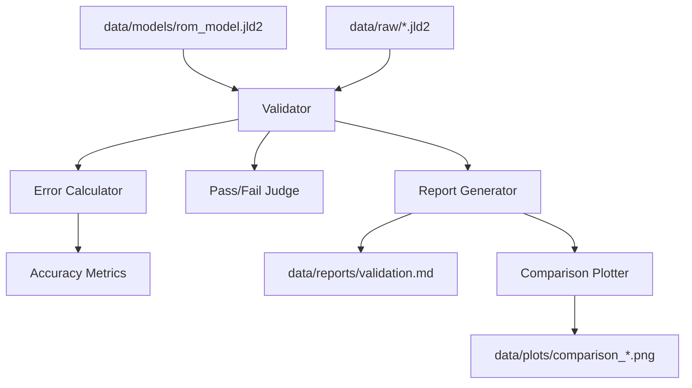

# Design Document: rom-validator

## Overview
`rom-validator` は、構築された次数低減モデル（ROM）の予測精度を、未知の設計パラメータ（密度マップ）に対して定量的に検証するためのコンポーネントである。FVMによる高精度な解析結果（正解データ）とROMの予測結果を比較し、物理的な妥当性と誤差統計を算出する。比較プロット生成には `Plots.jl` を使用し、画面のないサーバー・CI環境での動作に対応するため非表示描画モードを標準搭載する。

### Goals
- 学習に使用されていない検証用スナップショットを自動的に特定し、ロードする。
- 温度場全体の相対L2誤差、Tmax誤差、ホットスポット位置の幾何的距離誤差を算出する。
- 精度指標の統計（平均、最大）をまとめ、合格判定（Validated/Unfit）を行う。
- 指定された統一断面座標における ROM vs FVM の比較プロットおよび誤差マップ（計4画像）を生成する。
- ヘッドレスな実行環境への対応。

### Non-Goals
- スナップショットの生成（`snapshot-generator` の責務）。
- ROMの学習（`rom-interpolator` の責務）。
- 最適化ループ内でのリアルタイム評価。

## Boundary Commitments

### This Spec Owns
- 検証用データ（Snapshot）と学習済みROM（Model）の整合性チェック。
- 予測温度場と解析温度場の間の相対L2誤差、Tmax誤差、ホットスポット幾何距離の計算。
- 精度合格判定基準の適用（Tmax平均誤差による検証合否判定）。
- 評価レポート（JSON/Markdown）および指定断面での比較プロット生成。
- ヘッドレス描画環境変数設定の自動実行。

### Out of Boundary
- ROMの内部アルゴリズム（POD/RBF）の変更。
- スナップショット生成用のサンプリングパラメータの決定。

### Allowed Dependencies
- `PODEngine`: データ構造（`PODModel`）の再利用。
- `ROMInterpolator`: 予測実行インターフェースの利用。
- `LinearAlgebra`: 誤差ノルム計算。
- `Plots`: グラフプロット生成。
- `JSON3`: レポートのJSON保存。

### Revalidation Triggers
- `PODModel` の内部データ構造の変更。
- スナップショットファイル（`.jld2`）のスキーマ変更。

## Architecture

### Architecture Pattern
- **Evaluator Pattern**: 入力（モデルとデータ）を処理し、評価結果（メトリクスとレポート）を出力する独立した検証器。



### Technology Stack
| Layer | Choice | Role |
|-------|--------|------|
| Core Logic | Julia | 誤差計算および評価フロー制御 |
| Math | `LinearAlgebra.jl` | ノルム（norm）計算 |
| Storage | `JSON3.jl` | 評価レポートのJSON出力 |
| Visualization | `Plots.jl` | 比較プロットの生成 (GR バックエンド) |

### Evaluation Context and Physical Metadata

#### 幾何的ホットスポット位置誤差の逆算ロジック
検証には、平坦化された 1D 温度ベクトル上のインデックス `idx`（列優先 Column-major 順）から 3D グリッド内の物理座標 $(x, y, z)$ への逆変換を行い、幾何的な直線（ユークリッド）距離を計算する。

1. **1Dインデックス $idx \to$ 3Dグリッドインデックス $(i, j, k)$ への変換**:
   $$k = \text{div}(idx - 1, nx \cdot ny) + 1$$
   $$\text{rem} = \text{mod}(idx - 1, nx \cdot ny)$$
   $$j = \text{div}(\text{rem}, nx) + 1$$
   $$i = \text{mod}(\text{rem}, nx) + 1$$

2. **3Dインデックス $(i, j, k) \to$ 物理座標 $(x, y, z)$ への変換**:
   - $x = (i - 0.5) \cdot dx$ （ここで $dx = \frac{lx}{nx}$）
   - $y = (j - 0.5) \cdot dy$ （ここで $dy = \frac{ly}{ny}$）
   - $z = \text{z\_centers}[k]$

3. **物理距離の算出**:
   $$d = \sqrt{(x_{fvm} - x_{rom})^2 + (y_{fvm} - y_{rom})^2 + (z_{fvm} - z_{rom})^2}$$

#### 可視化スライス断面図の選定仕様
ケース間の比較をしやすくするため、プロット時に切り出すスライス位置は以下の固定の物理座標とする。
- **XY断面 (3画像)**: 熱源（TSV等）が存在する高さを代表する Z レベル 3 箇所（例: $z = 0.15\,\text{mm}$, $0.35\,\text{mm}$, $0.55\,\text{mm}$）。
- **YZ断面 (1画像)**: 熱源の中心を通る X 平面 1 箇所（例: $x = 0.5\,\text{mm}$）。

#### ヘッドレス非表示描画設定
`Plots.jl` ロード時、またはレポート出力処理の初期化時に、GRバックエンドが GUI のディスプレイサーバーへの接続を回避するように環境変数を設定する。
```julia
ENV["GKSwstype"] = "100"
```

## File Structure Plan

### Directory Structure
```
H2-rom/src/ROMValidator/
├── ROMValidator.jl   # メインモジュール・エントリ
├── types.jl          # 評価結果の構造体定義 (ValidationResult, ValidationSummary)
├── evaluator.jl      # 誤差計算・データ選定・合格判定ロジック
└── reporter.jl       # レポートおよび Plots.jl による比較プロット生成
```

## Requirements Traceability

| Requirement | Summary | Components | Interfaces |
|-------------|---------|------------|------------|
| 1.1 | 相対L2誤差の算出 | `Evaluator` | `calculate_l2_error` |
| 1.2 | Tmax誤差の算出 | `Evaluator` | `calculate_tmax_error` |
| 1.3 | ホットスポット位置誤差の算出 | `Evaluator` | `calculate_hotspot_error` |
| 1.4 | 平均・最大値のレポート | `Reporter` | `summarize_metrics` |
| 2.1 | 未学習スナップショットの特定 | `Evaluator` | `get_validation_samples` |
| 2.2 | 密度マップとFVM温度場の読み込み | `Evaluator` | `load_test_case` |
| 3.1 | Tmax閾値（2.0 K）判定 | `Evaluator` | `judge_accuracy` |
| 3.2 | 不合格ROMのマーク | `Evaluator` | `judge_accuracy` |
| 3.3 | 検証済みマーク | `Evaluator` | `judge_accuracy` |
| 4.1 | 評価レポート生成 | `Reporter` | `write_report` |
| 4.2 | 統一断面による比較プロット生成 | `Reporter` | `plot_comparison` |
| 4.3 | ヘッドレスGRバックエンド設定 | `Reporter` | `plot_comparison` |

## Components and Interfaces

### ROMValidator

#### Evaluator
| Field | Detail |
|-------|--------|
| Intent | 未知データに対する予測を呼び出し、FVM結果と比較して誤差統計および合否を算出する。 |
| Requirements | 1.1, 1.2, 1.3, 2.1, 2.2, 3.1, 3.2, 3.3 |

**Service Interface**
```julia
function run_validation(model_path::String, snapshot_dir::String; tmax_threshold=2.0) -> ValidationSummary
```

#### Reporter
| Field | Detail |
|-------|--------|
| Intent | 評価結果を JSON/Markdown 形式のファイルとして、また Plots.jl による断面プロット画像をヘッドレスで出力する。 |
| Requirements | 1.4, 4.1, 4.2, 4.3 |

**Service Interface**
```julia
function generate_report(summary::ValidationSummary, output_dir::String)
```

## Data Models

### ValidationResult (Struct)
- `sample_id`: String (スナップショットファイル名)
- `relative_l2_error`: Float64
- `tmax_error`: Float64
- `hotspot_dist`: Float64 (幾何的直線物理距離)
- `is_passed`: Bool

### ValidationSummary (Struct)
- `results`: Vector{ValidationResult}
- `mean_metrics`: Dict{String, Float64}
- `max_metrics`: Dict{String, Float64}
- `overall_status`: Symbol (`:validated` または `:unfit`)

## Testing Strategy
- **Unit Tests**:
    - `calculate_l2_error`: 期待通りの相対L2ノルム差が計算されるか。
    - `calculate_hotspot_error`: 1Dインデックスから 3D 物理座標を算出し、二点間の物理距離を正しく計算できるか。
    - `judge_accuracy`: 平均Tmax誤差が 2.0 K を超えた場合に正しく `:unfit` に分類されるか。
- **Integration Tests**:
    - ダミーのモデルデータとスナップショットを用いて、`run_validation` から `generate_report` が実行され、エラーなくプロット PNG 画像およびレポートファイルが指定ディレクトリに出力されることを検証（ヘッドレス環境でのテスト完走確認）。
