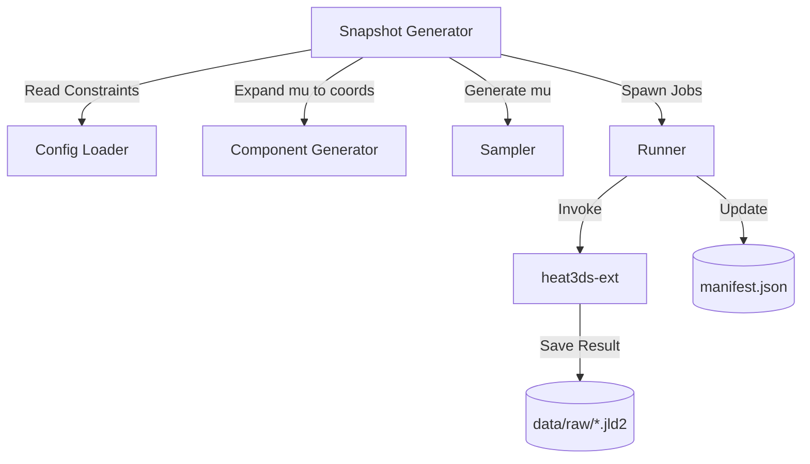

# Technical Design: Snapshot Generator

## Overview
Snapshot Generatorは、ROM（次数低減モデル）構築のために必要な大量のシミュレーション結果（スナップショット）を自動生成し、蓄積する機能を提供します。
本機能は、密度マップ（Density Map）形式で定義された高次元のパラメータ空間を効率的にサンプリングし、FVMソルバー（heat3ds.jl）を並列実行して、その結果とパラメータを紐付けて保存します。

### Goals
- 密度マップ形式のパラメータ（ベクトル `mu`）のLHSサンプリング。
- `component-generator` を介した、密度マップから実TSV座標への展開。
- FVMソルバーの自動一括実行とエラーハンドリング。
- スナップショットデータのJLD2形式での永続化と、`manifest.json` によるメタデータ管理。

### Non-Goals
- ROM（次数低減モデル）自体の構築や特異値分解（SVD）。
- 密度マップ以外のパラメータ（層厚など）の動的なサンプリング（現段階では定数扱い）。

## Boundary Commitments

### This Spec Owns
- パラメータサンプリングロジック（LHS）。
- ソルバー実行の並列化およびワークフロー管理。
- `data/manifest.json` の読み書きと整合性維持。
- `data/raw/` へのスナップショット保存指示。

### Out of Boundary
- FVMソルバー本体（heat3ds.jl）の熱計算ロジック。
- 実TSV座標の幾何学的算出（`component-generator` が担当）。
- 学習済みモデルの評価（`rom-validator` が担当）。

### Allowed Dependencies
- `ConfigLoader`: 設定の読み込み。
- `ComponentGenerator`: 密度マップから座標への展開。
- `JLD2.jl`, `JSON3.jl`: データ永続化。
- `LatinHypercubeSampling.jl`: サンプリングアルゴリズム。

### Revalidation Triggers
- `manifest.json` のスキーマ変更。
- スナップショット JLD2 ファイル内の変数名やデータ構造の変更。

## Architecture

### Architecture Pattern & Boundary Map
Snapshot Generatorは、他のモジュールを協調させる「オーケストレーション層」として機能します。



### Technology Stack

| Layer | Choice / Version | Role in Feature | Notes |
|-------|------------------|-----------------|-------|
| Sampling | LatinHypercubeSampling.jl | LHSアルゴリズム | 効率的な空間網羅 |
| Orchestration | Julia Distributed / Base.Threads | 並列実行管理 | CPUリソースの最適化 |
| Persistence | JLD2.jl | スナップショット保存 | 3D温度場（Float64配列）を高速保存 |
| Metadata | JSON3.jl | manifest管理 | 高速なJSON I/O |

## File Structure Plan

### Directory Structure
```
src/SnapshotGenerator/
├── SnapshotGenerator.jl   # エントリポイント、モジュール定義
├── Types.jl               # マニフェスト・実行状態の型定義
├── Sampler.jl             # LHSによるmuベクトルの生成
├── Runner.jl              # プロセス実行・並列制御
└── Manifest.jl            # manifest.json の操作
```

### Modified Files
- `H2-main-ext/src/heat3ds.jl` — `snapshot_path` を受け取り、JLD2保存を行うロジックの追加（`heat3ds-ext` 側での実装だが、本機能と連携）。
- `H2-main-ext/run.jl` — `--snapshot` オプションへの対応。

## Requirements Traceability

| Requirement | Summary | Components | Interfaces |
|-------------|---------|------------|------------|
| 1 | 密度マップサンプリング | `Sampler` | `generate_samples` |
| 2 | シミュレーション実行 | `Runner` | `run_simulations` |
| 3 | データ蓄積 | `Manifest`, `Runner` | `update_manifest!`, `save_snapshot` |
| 4 | エラーハンドリング | `Runner` | `handle_solver_error` |

## Components and Interfaces

### Sampler

| Field | Detail |
|-------|--------|
| Intent | 密度マップの空間をLHSでサンプリングする |
| Requirements | 1.1, 1.2, 1.3 |

**Responsibilities & Constraints**
- $G_x \times G_y$ 次元のユニットハイパーキューブをサンプリングする。
- `ComponentGenerator.Layout.adjust_density_constraints` を使用して、サンプリングされた `mu` が物理的な総本数制約 $N_{limit}$ を超えないよう調整する。
- **調整後の `mu`** を後続の処理（Runner）に渡す。

**Contracts**: Batch [x]
```julia
function generate_samples(n_samples::Int, grid_size::Tuple{Int, Int}; n_limit::Int)
    # 1. LHSサンプリングの実行
    # 2. adjust_density_constraints による補正
    # returns Vector{Vector{Float64}} (adjusted mu vectors)
end
```

### Runner

| Field | Detail |
|-------|--------|
| Intent | ソルバーをオーケストレートし、結果を回収する |
| Requirements | 2.1, 2.2, 2.3, 4.1, 4.2 |

**Responsibilities & Constraints**
- 各ケースに対して一意な `data/work/case_XXXX/` を作成する。
- 渡された **調整済み `mu`** を用いて `component-generator` を呼び出し、TSV 座標に展開する。
- ソルバーを外部プロセスまたはスレッドとして起動し、タイムアウトを監視する。
- シミュレーション結果を JLD2 に保存する際、**ユニークなスナップショットID** と **調整済み `mu`** をメタデータとして含める。

**Contracts**: Batch [x]
```julia
function run_simulations(samples::Vector{Vector{Float64}}, max_workers::Int)
    # Orchestrates the FVM solver runs
end
```

### Manifest

| Field | Detail |
|-------|--------|
| Intent | `manifest.json` の整合性を維持する |
| Requirements | 3.3, 4.3 |

**Responsibilities & Constraints**
- 実行済みの ID を管理し、中断後の再開を可能にする。
- パラメータ `mu` と、保存された `.jld2` へのパスを紐付ける。

**Contracts**: State [x]
```julia
function load_manifest(path::String) end
function update_manifest!(manifest::Manifest, case_info::CaseInfo) end
```

## Data Models

### Domain Model: Manifest
- `SnapshotManifest`: 全体のメタデータ（生成日時、パラメータ範囲、制約）。
- `SnapshotCase`: 各シミュレーション結果（ID、ステータス、調整済みmu、ファイルパス、実行時間）。

### Storage Model: JLD2 Snapshot
JLD2ファイルには以下の変数を格納する：
- `temperature`: 3D温度場配列 (Float64)。
- `metadata`: 以下の項目を含む辞書または構造体。
  - `snapshot_id`: ユニークなスナップショット番号。
  - `mu`: **調整済み**密度ベクトル。
  - `timestamp`: 生成時刻。

## Testing Strategy
- **Unit Tests**:
  - `Sampler`: 生成された `mu` が制約を遵守しているか、LHSの分布が妥当か。
  - `Manifest`: JSONの読み書きと、追加時のデータ整合性。
- **Integration Tests**:
  - ダミーの `mu` を用いて、`component-generator` -> `heat3ds-ext` -> `JLD2保存` の一連のフローが正常に動作するか。
- **E2E Tests**:
  - 少数のサンプル数（例: 2個）で、全自動で実行が完了し、`manifest.json` が更新されることの確認。
