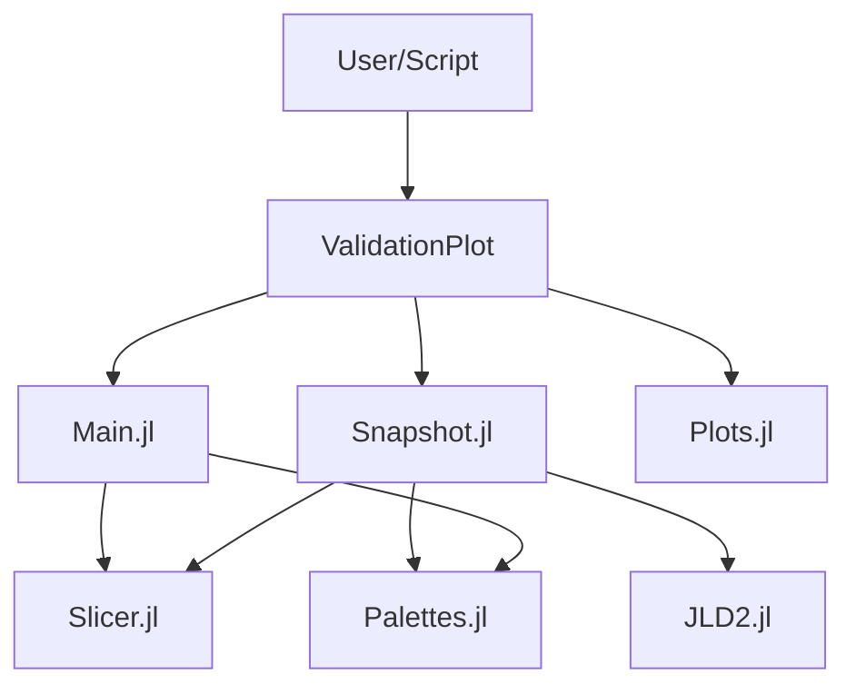

# Technical Design: validation-plot

## 1. Overview
本設計は、構築されたシミュレーションモデルおよび解析結果（スナップショット）の妥当性を視覚的に検証するためのプロット機能を定義する。特に、スナップショット（JLD2）からの自動抽出、レガシー配色（geo_overlay）の再現、および材料IDと温度場のサイドバイサイド表示に焦点を当てる。

## 2. Goals & Non-Goals
### Goals
- スナップショット（JLD2）から材料IDマップと温度場を抽出し、プロットする。
- 材料IDプロットにおいて、レガシーコード（H2-main_TSV_Opt）と互換性のある配色を使用する。
- IDマップと温度場を1つの画像内で横並び（サイドバイサイド）で表示する。
- 全ての温度場プロットで統一された温度スケールを適用する。

### Non-Goals
- GDSIIポリゴンの重ね書き（要件変更により除外）。
- 3DレンダリングやインタラクティブなGUI操作。
- ソルバー内部の計算ロジックの変更。

## 3. Boundary Commitments
### Spec Ownership
- スナップショットファイルの読み込みとデータ抽出。
- 断面抽出ロジック（Slicing）。
- プロット生成と画像保存。
- 材料IDに対するカラーパレットの管理。

### Out of Boundary
- スナップショットファイル（JLD2）自体の生成（`snapshot-generator` が担当）。
- 材料物理定数の定義。

### Allowed Dependencies
- `JLD2.jl`: スナップショットの読み込み。
- `Plots.jl`: プロット描画。
- `ConfigLoader`: 設定情報の参照。

## 4. Architecture
`ValidationPlot` モジュールを拡張し、既存のモデル検証機能（`plot_model_validation`）に加えて、スナップショット検証機能（`plot_snapshot_validation`）を追加する。

### Dependency Direction
`Snapshot.jl` / `Main.jl` → `Slicer.jl` / `Palettes.jl` → `JLD2.jl` / `Plots.jl`

## 5. File Structure Plan
| Path | Responsibility |
| :--- | :--- |
| `src/ValidationPlot/ValidationPlot.jl` | モジュールエントリ、公開関数のエクスポート。 |
| `src/ValidationPlot/Main.jl` | モデル構築時の検証プロット（既存機能の保守）。 |
| `src/ValidationPlot/Snapshot.jl` | スナップショット（JLD2）を対象としたプロットロジック。 |
| `src/ValidationPlot/Slicer.jl` | 3Dデータからの断面（XY, YZ）抽出ユーティリティ。 |
| `src/ValidationPlot/Palettes.jl` | 材料IDに対する共通カラーパレットの定義。 |

## 6. Components & Interfaces

### 6.1 Snapshot Plotter (`Snapshot.jl`)
- **Intent**: スナップショットファイルから検証画像を生成する。
- **Requirements**: 3.1, 3.2, 4.1, 4.2
- **Interface**:
  - `plot_snapshot_validation(snapshot_path::String; output_dir="plots", temp_lims=(300.0, 400.0))`
    - `snapshot_path`: JLD2ファイルへのパス。
    - `temp_lims`: 温度スケールの固定範囲（Requirement 2.3対応）。

### 6.2 Common Palettes (`Palettes.jl`)
- **Intent**: 材料IDと色のマッピングを一元管理する。
- **Requirements**: 2.1, 3.2
- **Constants**:
  - `LEGACY_COLOR_PALETTE`: `[:yellow, :gray, :purple, :orange, :blue, :green, :red]`
  - `MATERIAL_LABELS`: `["TSV", "Si", "Solder", "FR4", "Al", "Resin", "PG"]`

## 7. Requirements Traceability
| Requirement | Summary | Components | Interfaces |
| :--- | :--- | :--- | :--- |
| 1.1 | JSON指定のスライス | `Main.jl` | `plot_model_validation` |
| 1.2 | 物理スケーリング | `Slicer.jl` | 座標軸変換ロジック |
| 2.1 | 材料分布プロット | `Palettes.jl` | `LEGACY_COLOR_PALETTE` |
| 2.2 | 温度分布プロット | `Snapshot.jl` | `theta` の描画 |
| 2.3 | 温度スケールの統一 | `Snapshot.jl` | `temp_lims` パラメータ |
| 3.1 | スナップショット読み込み | `Snapshot.jl` | `jldopen` による抽出 |
| 3.2 | TSV検証プロット再現 | `Palettes.jl` | レガシーパレットの適用 |
| 4.1 | サイドバイサイド表示 | `Snapshot.jl` | `plot(p1, p2, layout=(1,2))` |
| 4.2 | 画像エクスポート | `Snapshot.jl` | `savefig` |

## 8. Testing Strategy
- **Unit Tests**:
  - `Slicer.jl`: 物理座標からインデックスへの変換、断面抽出の正確性。
  - `Palettes.jl`: カラーパレットの定義がレガシーと一致すること。
- **Integration Tests**:
  - テスト用のスナップショット（JLD2）を読み込み、正常に画像ファイルが出力されること。
  - プロットの `clims` が `temp_lims` と一致していることの確認。

## 9. Integration & Migration Notes
- 既存の `plot_model_validation` からGDSオーバーレイのコードを削除またはオプショナル化する。
- `ValidationPlot.jl` で `Snapshot.jl` をインクルードし、外部から利用可能にする。
