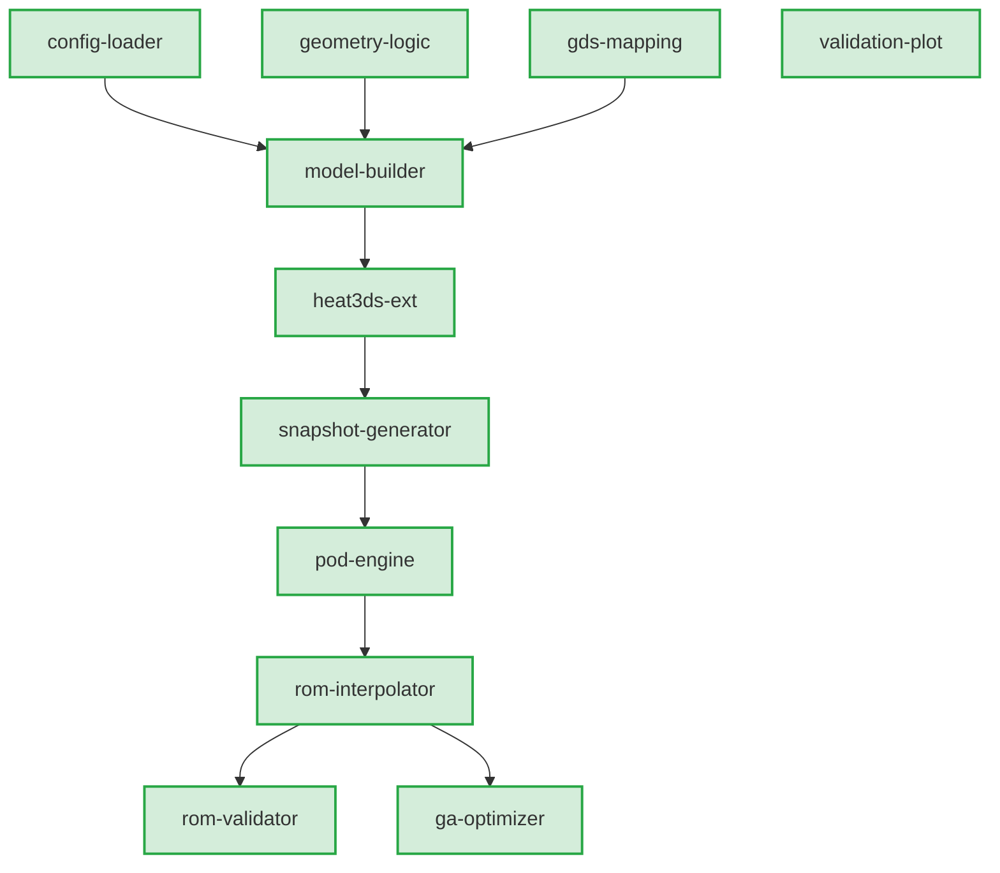

# 3D-IC 熱解析・最適化システム (3D-IC Heat Optimization & ROM System)

本リポジトリは、3次元積層半導体 (3D-IC) におけるシリコン貫通ビア (TSV) や熱源・はんだバンプの密度配置を対象とした、**3D-FVM（有限体積法）熱シミュレータ**、**次数低減モデル (ROM: Reduced Order Model)**、および **GA（遺伝的アルゴリズム）最適化エンジン** を含む統合シミュレーション・最適化システムです。

---

## 🌟 主な機能と特徴 (Key Features)

1. **3D-FVM 高精度熱計算エンジン (`heat3ds-ext`, `model-builder`)**:
   * 直方体・円柱・球プリミティブおよびGDSIIポリゴンに対応した3D格子充填・物性値マッピング。
   * 異種材料（Si, SiO2, Cu, TSV, はんだバンプ等）の複雑な熱伝導率分布を評価。
2. **POD + RBF に基づく高速次数低減モデル (ROM) (`pod-engine`, `rom-interpolator`)**:
   * 特異値分解 (SVD/POD) により高次元熱伝導方程式の空間基底モードを抽出。
   * 密度パラメータ ($\mu$) から POD モード係数への RBF (Radial Basis Function) 補間モデルを自動構築。
   * 数千〜数万グリッドの3D熱計算をミリ秒単位で高速推論・3D温度場再構成。
3. **制約付き GA 最適化エンジン (`ga-optimizer`)**:
   * 総TSV本数や幾何的制約を満たす最適な密度マップを遺伝的アルゴリズムで探索。
   * 高速ROM評価と適宜FVM再検証を組み合わせ、最高温度 ($T_{\max}$) を最小化。
4. **論文評価 & 自動検証ツール (`rom-paper-evaluation`, `rom-validator`)**:
   * SVD減衰率・RIC寄与率推移プロット、RBFスイープ感度解析、新旧FVM等価性自動検証機能を標準搭載。

---

## 🏗️ システムアーキテクチャ (Architecture)



各モジュールの詳細仕様および実装ステータスについては [system_spec_status.md](system_spec_status.md) をご参照ください。

---

## 💻 動作環境 & セットアップ (Prerequisites & Setup)

### 1. 動作環境
* **Julia**: v1.9 以上推奨
* **OS**: Linux / macOS / WSL2 (Windows)

### 2. 環境構築
リポジトリをクローンし、`H2-rom` プロジェクトの依存関係をセットアップします。

```bash
git clone https://github.com/Daioku799/somad_dev3.git
cd somad_dev3

# Juliaパッケージの依存関係解決
julia --project=H2-rom -e 'using Pkg; Pkg.instantiate()'
```

---

## 🚀 クイックスタート & 実行ガイド (Usage Workflow)

### 1. 全自動論文評価 & データ収集
論文用のSVD解析プロット、感度解析、ROM構築時間計測などを一括実行し、`plots/paper_evaluation/` に出力します。

```bash
julia --project=H2-rom evaluate_rom_paper.jl
```

### 2. 新旧FVMシミュレータ等価性検証
レガシーFVMと拡張FVM (`heat3ds-ext`) の熱計算結果およびアサーション検証を行います。

```bash
julia --project=H2-rom verify_legacy_fvm.jl
```

### 3. 全テストの実行
システム全13モジュールのユニットテスト・統合テストを実行します。

```bash
(cd H2-rom && julia --project=. test/run_tests.jl)
```

---

## 📂 ディレクトリ構成 (Directory Structure)

```
somad_dev3/
├── .kiro/
│   ├── steering/            # プロジェクト共通方針・エージェント運用規約
│   └── specs/               # 仕様定義およびタスク管理 (全13モジュール)
├── H2-rom/                  # ROM / GA / 評価モジュールメイン実装
│   ├── src/                 # パッケージソースコード
│   ├── test/                # ユニット・統合テストスイート
│   └── Project.toml         # Julia プロジェクト依存定義
├── H2-main-ext/             # 3D-IC FVM シミュレータ拡張モジュール
├── legacy/                  # 従来手法（レガシーFVM）比較検証用コード
├── data/                    # スナップショットデータ・学習済みモデル・マニフェスト
├── plots/                   # 論文評価・検証用各種プロット画像出力
├── evaluate_rom_paper.jl    # 論文用総合評価・データ収集スクリプト
├── verify_legacy_fvm.jl     # 新旧FVM等価性自動検証スクリプト
├── system_spec_status.md    # 全13モジュールの仕様・進捗ダッシュボード
└── README.md                # 本ドキュメント
```

---

## 🤖 Antigravity CLI (agy) 運用規約 & エージェント全権委譲ポリシー

本プロジェクトでは、AIエージェント（Antigravity CLI / agy）に開発およびタスク遂行の全権委譲を行い、自律的な開発推進と厳格なGitバージョン管理を両立させます。

### 1. 🚀 agy 起動時ルール (Session Initialization)
1. **リポジトリ状態の把握**:
   * 起動直後に `git status` を実行し、未コミットの変更や作業ブランチの状態を確認する。
2. **仕様・進捗情報のロード**:
   * `.kiro/steering/` および `system_spec_status.md` を確認し、現在の開発フェーズと残存タスクを特定する。

### 2. ⚡ 方針事前確認 ＆ 明示的承認獲得 ＆ こまめな Git コミットルール

1. **方針事前提示と明示的承認 (Explicit Approval Requirement)**:
   * 軽微な修正（タイポ修正、ドキュメントの補足等）を除き、**コードの書き換えや新規スクリプト作成、リファクタリング**、または**実行時間のかかるプログラム・シミュレーション・テストの実行**に入る前に、**「これからどのような方針・手順・影響範囲で何を実行するか」** の計画概要を提示し、ユーザーから明示的な承認を得てから作業を開始します。
2. **個別の承認操作（Enter押し）の省略と自律実行**:
   * 方針について明示的な承認を得た後は、承認計画の範囲内で個別ツール承認を省略しスムーズに自動実行します。
3. **小刻みなコミットの徹底 (Atomic Commits / Git書き込みルール)**:
   * **1タスク完了ごと**、または**論理的な1単位の変更ごと**に、必ず検証テストを通した上で即座に Git コミットを実行します。
   * プレフィックスを明確にしたコミットメッセージを使用します（`feat:`, `fix:`, `test:`, `docs:`, `refactor:` 等）。
4. **品質保証の義務**:
   * コミット前に該当のテスト（例: `(cd H2-rom && julia --project=. test/run_tests.jl)`）を実行し、エラーが発生していないことを確認します。

### 3. 🏁 agy 終了時ルール (Session Shutdown)
1. **コミット漏れの防止**:
   * 終了前に `git status` を確認し、作業ツリーに未コミットの変更を残さない。
2. **ステータスドキュメントの同期**:
   * `.kiro/specs/$FEATURE/tasks.md` および `system_spec_status.md` のタスク完了チェック（`[x]`）と進捗状況を最新に更新する。
3. **サマリー報告**:
   * 実行した作業内容、追加されたGitコミット一覧、作成された成果物（画像・レポート）のまとめをユーザーに分かりやすく提示する。

### 4. 🚨 エラー・異常終了時ルール (Error & Crash Recovery)
1. **ログ最優先の因果分析 (`kiro-debug`)**:
   * エラーやプロセス停止が発生した場合は、推測で修正を行わず、まずスタックトレーサーやログをフルテキストで取得・精査する。
2. **作業ツリーの安全性確保**:
   * ビルドエラーや不完全な状態のコードをそのままコミットしない。
   * 復旧が困難な場合は `git diff` を確認し、一度安全な状態に戻すか、失敗原因を特定してから適切な修正を行う。
