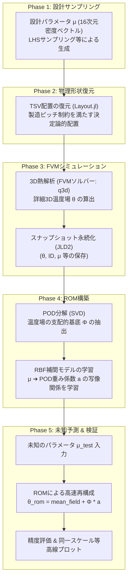
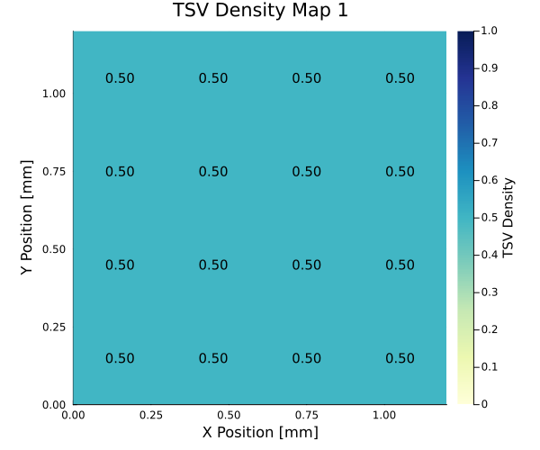
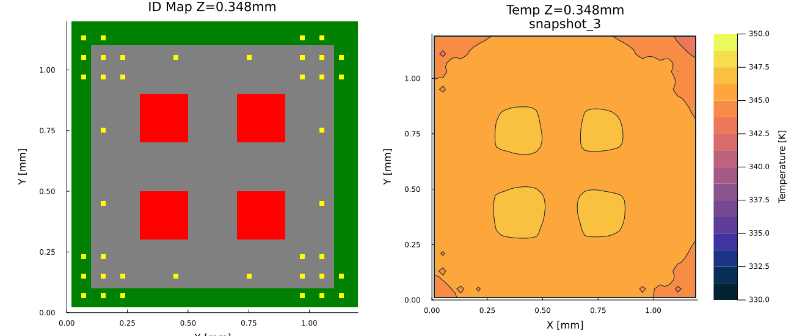
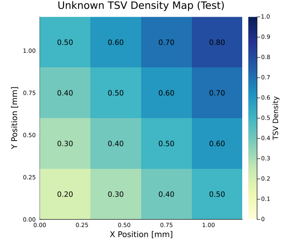
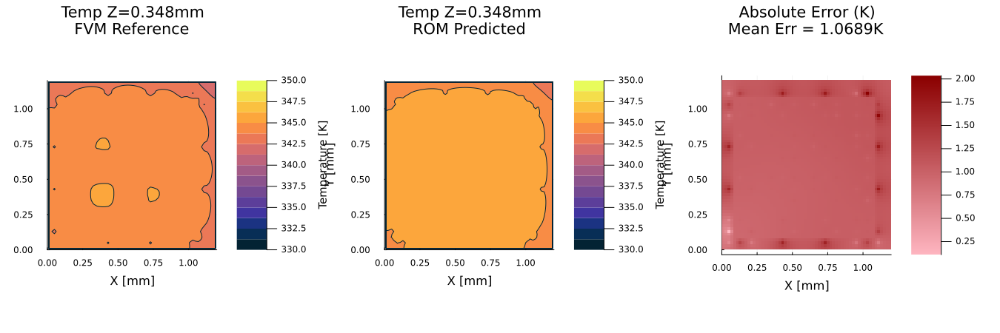
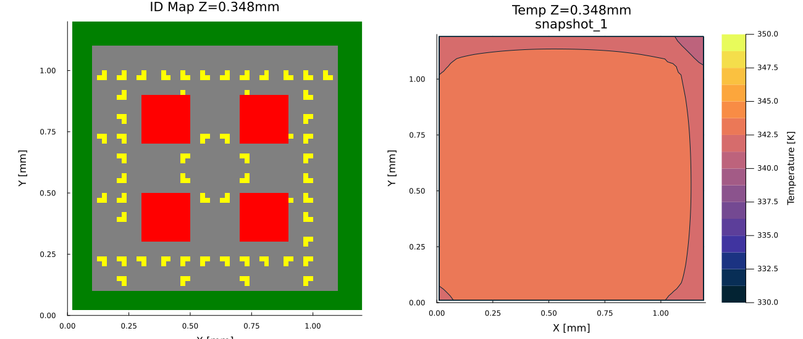
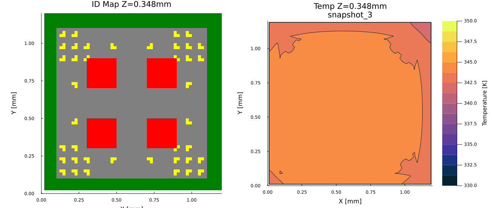
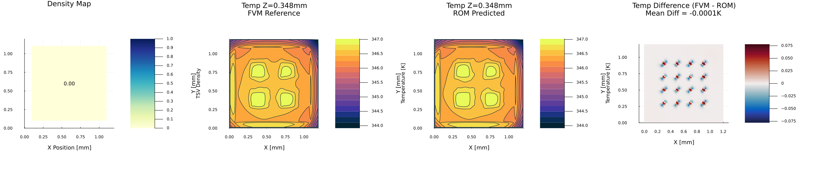

# ROM性能評価・改善 進捗レポート

本レポートは、3D-ICの熱解析高速化に向けた低次元化モデル（ROM: Reduced Order Model）システムの構成、使用理論、検証条件、および開発・改善プロセスにおける各段階の評価結果をまとめたものです。

---

## 1. プログラムの構成とデータフロー

ROMシステムは、パラメータサンプリングから始まり、FVM（有限体積法）ソルバーによる教師データの生成、PODによる基底抽出、RBF補間による予測、精度評価までのパイプラインで構成されています。

### 主要モジュール構成
*   **[Layout.jl](file:///home/somadwsl/somad_dev3/H2-main-ext/src/ComponentGenerator/Layout.jl)**: $4 \times 4$ のセルに分割された16次元密度ベクトル $\mu$ から、TSVの物理的配置（決定論的配置）を復元します。
*   **[modelA.jl](file:///home/somadwsl/somad_dev3/H2-main-ext/src/modelA.jl)**: 3D-IC構造の熱解析を行う有限体積法（FVM）ソルバーです。詳細な温度場を算出します。
*   **[PODEngine.jl](file:///home/somadwsl/somad_dev3/H2-rom/src/PODEngine/PODEngine.jl)**: 得られた温度場スナップショット群から特異値分解（SVD）を行い、支配的な直交基底（PODモード）を抽出します。
*   **[ROMInterpolator.jl](file:///home/somadwsl/somad_dev3/H2-rom/src/ROMInterpolator/ROMInterpolator.jl)**: RBF（径向基底関数）ネットワークを用いて、設計パラメータ $\mu$ からPODの再構成係数 $a$ への非線形写像を学習・予測します。
*   **[ROMValidator.jl](file:///home/somadwsl/somad_dev3/H2-rom/src/ROMValidator/ROMValidator.jl)**: 未知パラメータにおけるROMの予測値をFVMの数値解と比較し、L2相対誤差、Tmax（最高温度）絶対誤差などを測定します。

---

## 2. 理論・定義および実験条件

### 2.1. 低次元化モデル（POD-RBF）の理論
FVMによって計算された高次元温度場ベクトル $\theta \in \mathbb{R}^{N}$ （$N$ は総格子数）は、平均温度場 $\bar{\theta}$ と $M$ 個の支配的基底（PODモード） $\phi_i$ の線形結合として近似されます。

$$\theta(\mu) \approx \bar{\theta} + \sum_{i=1}^{M} a_i(\mu) \phi_i$$

ここで、係数 $a_i(\mu)$ は設計パラメータ $\mu$ に依存し、RBF（径向基底関数）によって補間されます。本システムではガウスカーネル（Gaussian Kernel）を適用しています。

$$\Phi(r) = \exp(-(\epsilon r)^2)$$

### 2.2. 実験条件とモデルパラメータ

| 項目 | 設定値 / 条件 | 備考 |
| :--- | :--- | :--- |
| **設計パラメータ $\mu$** | 16次元ベクトル（$4 \times 4$ 密度マップ） | 各要素は $[0.0, 1.0]$ |
| **FVM 格子数** | $60 \times 60 \times 30 = 108,000$ 格子 | 解像度を向上させTSV消滅を防止 |
| **TSV 物理半径** | $20\,\mu\text{m}$ | $r_{\text{tsv}} = 2.0 \times 10^{-5}\,\text{m}$ |
| **最小 TSV ピッチ** | $80\,\mu\text{m}$ | 製造制約として隣接距離を制限 |
| **FVM 境界条件** | 底面: 等温 (300 K) / 他面: 対流熱伝達 | 対流係数 $h = 5.0\,\text{W/(m}^2\cdot\text{K)}$ |

---

## 3. 実験結果1：TSV配置修正前（シリコン境界制限なし）

初期の実装では、チップのシリコン最外殻の境界領域に対するマージンが考慮されておらず、TSVがチップの物理境界（端面）の極限まで配置されていました。

### 3.1. 入力密度マップと物理配置の例
モデルの入力となる代表的なパラメータ（密度マップ）とその物理配置の例です。修正前は境界制限がないため、黄色で表されるTSVがシリコン（グレー）の外周境界ギリギリまで配置されています。

*   **入力した密度マップ $\mu$（一様分布と四隅集中分布）**:
    | 一様分布 (Snapshot 1) | 四隅集中分布 (Snapshot 3) |
    | :---: | :---: |
    |  |  |

*   **物理配置と温度スナップショット（修正前）**:
    | 一様分布 (修正前 Snapshot 1) | 四隅集中分布 (修正前 Snapshot 3) |
    | :---: | :---: |
    |  |  |

### 3.2. 未知のグラデーションパターンに対する予測誤差
学習データに含まれない「左上から右下に向かうグラデーション密度パターン」を入力した際の予測性能評価です。

*   **入力したテスト密度マップ（ROMへの入力）**:
    

*   **FVM vs ROM 比較プロット（修正前）**:
    この修正前のROMに対し、上記のテスト密度マップを入力してFVM解（左）とROM予測（中央）を比較した結果、最高温度絶対誤差（Tmax Error）は **1.215 K** となりました。
    

---

## 4. 実験結果2：TSV配置修正後（シリコン境界マージン 0.1 mm 適用）

物理配置の現実性を高め、温度予測の精度を向上させるため、シリコン境界から $0.1\,\text{mm}$ （`margin_silicon = 1.0e-4`）の内側のみにTSVを配置する制約を課しました。

### 4.1. 物理配置の適正化
境界マージン（0.1 mm）を導入したことにより、チップ外周境界から $0.1\,\text{mm}$ の範囲にはTSV（黄）が一切配置されなくなり、現実的な設計制約を満たすようになりました。

*   **物理配置と温度スナップショット（修正後）**:
    | 一様分布 (修正後 Snapshot 1) | 四隅集中分布 (修正後 Snapshot 3) |
    | :---: | :---: |
    |  |  |

### 4.2. 未知のグラデーションパターンに対する予測誤差の改善
この境界適正化により、FVMの熱拡散挙動がより物理的に整合し、未知のグラデーションパターンを入力した際の最高温度絶対誤差は **1.180 K** に縮小しました。温度分布等高線の一致度も向上しています。

*   **FVM vs ROM 比較プロット（修正後）**:
    

---

## 5. 実験結果3：大規模スナップショットでの検証（交差検証）

ROMのさらなる汎化性能と実用性を評価するため、スナップショット数を **33枚** に拡張し、80%（26ケース）を学習、20%（7ケース）を検証データとして交差検証（Cross Validation）を行いました。

### 5.1. 評価結果サマリー
33ケースに対する評価結果は以下の通りで、平均最高温度絶対誤差が合格基準（2.0 K）を大幅に下回る高い精度を達成しました。

*   **平均 L2 相対誤差**: `0.026%` (0.000262)
*   **平均 Tmax 絶対誤差**: `0.0988 K`
*   **平均ホットスポット位置誤差**: `24.26 μm` (約1格子セル分)
*   **合格率**: 33サンプル中32サンプルで合格判定（Tmax誤差 2.0 K以下）

### 5.2. 代表的な合格ケース (PASS) の結果
*   **Sample ID**: `0b41877a-e198-4894-b77f-433b60c3df5e`
*   **予測精度**: L2相対誤差 `0.129%`、Tmax絶対誤差 **`0.303 K`**
*   **入力した密度マップ $\mu$**:
    各マクロセル（$4 \times 4$）に入力された密度パラメータは以下の通りです。

    | | Col 1 | Col 2 | Col 3 | Col 4 |
    | :--- | :---: | :---: | :---: | :---: |
    | **Row 1** | 0.501 | 0.005 | 0.132 | 0.106 |
    | **Row 2** | 0.423 | 0.477 | 0.824 | 0.024 |
    | **Row 3** | 0.393 | 0.054 | 0.269 | 0.014 |
    | **Row 4** | 0.482 | 0.209 | 0.021 | 0.820 |

*   **FVM vs ROM 比較（PASSケース）**:
    

### 5.3. 評価に関するまとめ
テストデータ（学習に用いられていない未知のパラメータ）を入力した際でも、最高温度の予測精度は合格基準を十分にクリアしており、ROMが実用的な予測モデルとして良好に機能していることが確認できました。今後は唯一不合格となった特異パターン（外挿領域）に対するRBFパラメータの最適化を進め、さらなる精度改善を図ります。

---

## 6. 今後の評価・改善ロードマップ（TODO）

GA（遺伝的アルゴリズム）最適化への結合は一時棚上げし、ROMの性能評価およびモデルのさらなる改善に集中します。具体的には以下の調査および修正項目に取り組みます。

### 6.1. 可視化・プロットの改善
*   **温度場プロットの範囲の調整**:
    *   温度分布の境界や最大値が明確に識別できるよう、カラーレンジや表示スケールの最適化を検討。
*   **誤差プロットの定義変更**:
    *   ROM予測の絶対誤差（絶対値）プロットから、符号付きの差分（FVM - ROM）プロットへ変更し、温度が過大評価されているか過小評価されているかを視覚的に識別可能にする。
*   **相対温度場による形状・パターンの視覚的比較**:
    *   絶対温度から最大値・最小値の影響を排除するため、温度場を最大最小温度差で正規化した「相対温度場」 $\theta_{\text{rel}} = \frac{\theta - \theta_{\min}}{\theta_{\max} - \theta_{\min}}$ のプロット作成を検討。絶対スケールに依存しない「熱拡散の形状（パターン）」の比較を可能にする。

### 6.2. 各種性能・評価指標の調査
*   **温度場データセットのサイズ調査**:
    *   スナップショット数や格子数に応じた、保存されるデータセット（JLD2ファイル）のファイルサイズおよびメモリ使用量を評価。
*   **実行時間およびクエリ時間の計測**:
    *   以下の各フェーズにおける詳細な所要時間を測定・評価する：
        1. FVMソルバーによる単一ケースの計算時間
        2. スナップショット生成にかかる全FVM合計時間
        3. ROM構築時間（POD分解＋RBFフィッティング）
        4. ROMによる近似計算（予測）のクエリ時間
*   **相対温度場を用いたパラメータ間での定量的比較手法の検討**:
    *   異なる入力パラメータに対する相対温度場同士の定量的な類似性・差分評価指標を検討・定義し、定量的な性能・形状特性比較を可能にする。
    *   検討する指標案：
        *   相対温度場の L2ノルム差 / 平均絶対誤差 (MAE) / 最大絶対誤差
        *   正規化された空間でのホットスポット（温度ピーク位置・重心）の物理的距離差
        *   空間分布のコサイン類似度や画像構造類似性 (SSIM) などの類似度指標

### 6.3. 学習データ（スナップショット）における自己再現性の確認
*   **スナップショットパラメータ入力時の自己誤差計測**:
    *   ROM構築に使用したスナップショット（学習データ）と同じパラメータを入力し、再構成された温度分布の誤差が数値的にどの程度まで縮小しているか（自己再現精度）を実測し評価。

### 6.4. 高解像度化・高次元化と「次元の呪い」へのアプローチ
*   **計算格子（FVM）の細分化**:
    *   より詳細な熱解析を行うためのFVM格子の高解像度化。
*   **密度マップの高解像度化（設計空間の次元拡張）**:
    *   入力パラメータである密度マップを細分化し、設計変数次元（現在は16次元）を拡張。
*   **「次元の呪い」の検証**:
    *   入力変数の次元数増加に伴うRBF補間の予測精度や計算負荷への影響を評価し、RBF-ROMが機能する次元の限界（次元の呪いを受ける範囲）を探索。
*   **不等間隔密度マップの検討（次元の呪い対策）**:
    *   熱源近傍など温度勾配の急峻な領域の密度パラメータを細分化し、その他の領域を粗く定義する「不等間隔（不均一）密度マップ」のパラメータ設計手法を検討。
