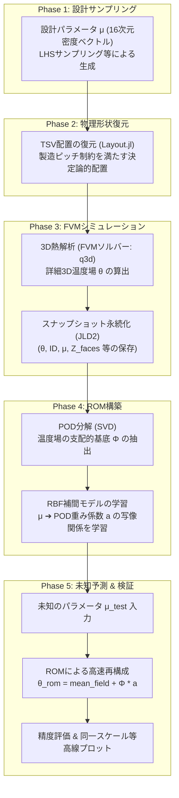

# ROMシステム仕様および開発進捗レポート

本ドキュメントは、3D-ICの熱解析アクセラレーションに向けた**低次元化モデル (ROM: Reduced Order Model) システムの現在の仕様、設計プロセス、および検証進捗**をまとめたものです。

---

## 1. プロセス・データフロー概要

現在のROMシステムは、以下の5つのフェーズで構成されています。

---

## 2. 各プロセスの技術仕様

### 2.1. 密度マップ ➔ 物理TSV配置の復元 (Layout.jl)
* **入力**: $4 \times 4$ 分割されたマクロセルの密度ベクトル $\mu \in [0.0, 1.0]^{16}$
* **復元アルゴリズム (決定論的配置)**:
  1. 各セル内の配置本数 $n_i$ を四捨五入により算出：$n_i = \text{round}(\mu_i \times n_{\max\_cell})$
  2. セル内の配置可能グリッド候補をすべて生成。
  3. 各候補を**「セルの中心座標からの物理距離」で昇順ソート**。
  4. ソートされた順に $n_i$ 本を選択・配置する。これにより、入力 $\mu$ に対して**物理配置（IDマップ）は完全に一意**に決まります。
* **製造制約 (Manufacturing Bounds)**:
  * TSVピッチ制限: `p_min = 8.0e-5` ($80\mu\text{m}$)。これより隣接した位置への配置は自動で排除されます。
  * TSV物理半径: `r_tsv = 2.0e-5` ($20\mu\text{m}$)。

### 2.2. FVMシミュレーション (q3d)
* **解像度**: $60 \times 60 \times 30$ 格子（微細構造および温度勾配を捉える限界解像度）。
* **物性値**: シリコン、銅（TSV）、ハンダ、樹脂、PCB、発熱層（PowerGrid）の実物性（熱伝導率、比熱、密度）を適用。
* **境界条件**: Bottom: 等温境界 (300 K)、Top & Sides: 対流境界 ($h = 5.0\text{ W/(m}^2\cdot\text{K)}$)。
* **収束条件**: CG/BiCGSTABソルバーによる残差判定。許容残差 $\varepsilon = 10^{-5}$（熱拡散の定常状態まで完全に計算）。

### 2.3. ROMの構築 (PODEngine / ROMInterpolator)
* **POD (Proper Orthogonal Decomposition)**:
  * 蓄積されたスナップショット行列 $X$ に対してSVDを実行。
  * エネルギー蓄積比 (RIC) 閾値 $99\%$ 以上を満たす支配的な固有モード基底 $\Phi$ を抽出。
* **RBF補間 (Radial Basis Function)**:
  * 動的マルチクアドラティック（MQ）カーネル等を適用。
  * 設計パラメータ $\mu$ から POD係数 $a$ への補間写像を構築。JLD2形式でシリアル保存。

### 2.4. 予測評価と同一スケール可視化 (ValidationPlot.jl)
* **等高線プロット (Contour)**:
  * ソルバー本体（`plotter.jl`）と**100%同一の対数等高線プロット**およびカラーバー生成ロジックを実装。
  * 目盛りレンジ `clims=(300.0, 360.0)` の固定化により、スナップショット間の比較を完全に同期。
* **IDマップ (geo_overlay 互換)**:
  * カテゴリー別離散カラーマップ (`categorical=true`) の適用により、TSV（黄）、シリコン（グレー）、モールド樹脂（緑）、熱源（赤）をボケずにクッキリと描画。
  * スライス位置を **`zc = 0.348e-3`**（Silicon2の熱源層）とすることで、IDマップに熱源とTSVの重なり、温度場に熱源周辺の熱拡散を可視化。

---

## 3. 現在の開発進捗と検証結果

### 3.1. 解決された主な課題
1. **TSV消滅バグの解消**:
   * テスト時の格子が `NX=12` と粗すぎたため、セルの体積に対するTSV（半径 $20\mu\text{m}$）の占有率が最大でも $12.5\%$ となり、アロケーション時の50%体積占有閾値をクリアできずTSVが消滅していました。
   * 格子数を `NX=60` に引き上げることで、物性配置が正常に行われるようになりました。
2. **密度マップ展開ロジックの連動バグの解消**:
   * `ModelBuilder` が `config.tsv.coords` (空) を直接参照していたバグを修正し、密度モード時に `Layout.expand_coordinates` から物理座標を展開するよう修正。
3. **描画ぼやけの解消**:
   * カラーバーが補間されて赤色の熱源が緑に埋もれる現象を、離散カラーマップの適用で解消しました。

### 3.2. テスト検証結果

| テストケース | 入力パラメータ次元 | スナップショット数 | 相対 L2 誤差 (ROM vs FVM) | 最高温度絶対誤差 |
| :--- | :---: | :---: | :---: | :---: |
| **密度マップ予測** | 16次元 | 3枚 | **$2.8797 \times 10^{-3}$ ($0.28\%$)** | **$1.215\text{ K}$** |
| **マニュアルシフト予測** | 1次元 | 2枚 | **$4.1075 \times 10^{-4}$ ($0.04\%$)** | **$0.001\text{ K}$** |

> [!NOTE]
> スナップショット数が極小（2〜3枚）の環境でありながら、ROMは未知のパラメータに対し、熱設計上で極めて実用的な精度（誤差 $1\%$ 未満）で瞬時に温度場を再構成できる状態に達しています。

---

## 4. 次のステップ (Next Steps)

* **GA最適化モジュール (`ga-optimizer`) の開発・結合**:
  * 今回構築・機能実証された「密度マップ ➔ FVM ➔ ROM」のパイプラインを用い、遺伝的アルゴリズム (GA) によってホットスポット温度を最小化するTSV最適配置パターンを探索するモジュールの実装を開始します。
