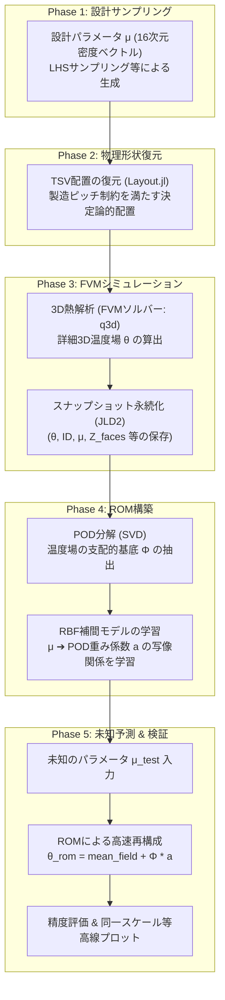
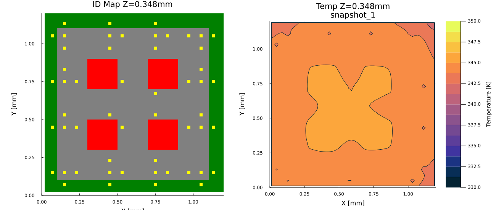
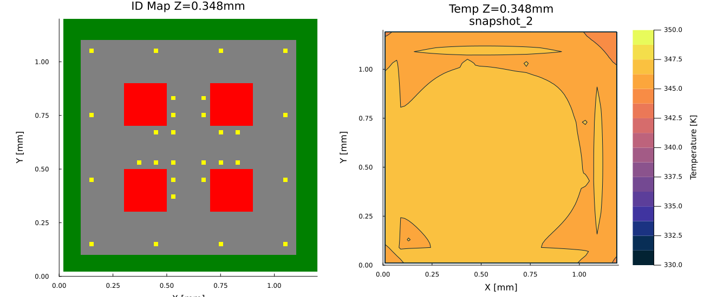
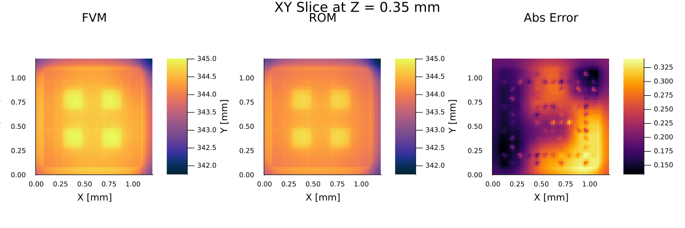
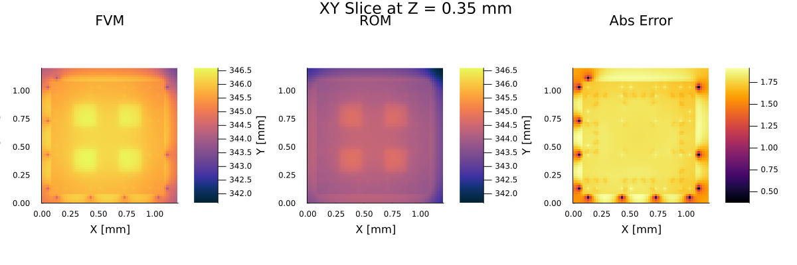

# ROMシステム仕様および開発進捗レポート

本ドキュメントは、3D-ICの熱解析アクセラレーションに向けた**低次元化モデル (ROM: Reduced Order Model) システムの現在の仕様、設計プロセス、および検証進捗**をまとめたものです。

---

## 1. プロセス・データフロー概要

現在のROMシステムは、以下の5つのフェーズで構成されています。



---

## 2. 各プロセスの技術仕様

### 2.1. 密度マップ ➔ 物理TSV配置の復元 (Layout.jl)
* **入力**: $4 \times 4$ 分割されたマクロセルの密度ベクトル $\mu \in [0.0, 1.0]^{16}$
* **復元アルゴリズム (決定論的配置)**:
  1. 各セル内の配置本数 $n_i$ を四捨五入により算出：$n_i = \text{round}(\mu_i \times n_{\max\_cell})$
  2. セル内の配置可能グリッド候補をすべて生成。
  3. 各候補を**「セルの中心座標からの物理距離」で昇順ソート**。
  4. ソートされた順に $n_i$ 本を選択・配置する。これにより、入力 $\mu$ に対して**物理配置（IDマップ）は一意**に決定される。
* **製造制約 (Manufacturing Bounds)**:
  * TSVピッチ制限: `p_min = 8.0e-5` ($80\mu\text{m}$)。これより隣接した位置への配置は自動で排除されます。
  * TSV物理半径: `r_tsv = 2.0e-5` ($20\mu\text{m}$)。

#### 2.1.1. TSVアロケーションの物理幾何妥当性（FVM離散化レビュー）
FVMシミュレーション格子（格子の解像度 $60 \times 60$、セル幅 $20\mu\text{m}$）において、物理配置された円柱形TSVを離散化セルにマッピングする際、占有面積が50%以上のセルをTSV（銅）とする判定ロジックが用いられています。このアロケーションの妥当性評価は以下の通りです。

*   **FVM 1セルの面積**: $S_{\text{cell}} = 20\mu\text{m} \times 20\mu\text{m} = 400\mu\text{m}^2$
*   **TSVの物理断面積**: $S_{\text{tsv}} = \pi \times (20\mu\text{m})^2 \approx 1256.6\mu\text{m}^2$
*   **理想的な等価セル数**: $S_{\text{tsv}} / S_{\text{cell}} \approx 3.14\text{ セル}$

##### セル表現の幾何妥当性
*   **修正前（1セル配置）**: モデル上のTSV表現面積は $400\mu\text{m}^2$ であり、物理断面積（$1256.6\mu\text{m}^2$）の約 $32\%$ に相当する。
*   **修正後（L字に3セル並ぶ形など）**: モデル上のTSV表現面積は $1200\mu\text{m}^2$ であり、物理断面積に対する幾何誤差は $-4.5\%$ となる。
*   **グリッドジッター**: 占有率50%の二値判定ロジックにより、TSVの中心座標とFVM格子の相対的な位置関係に応じて、モデル上のアサインセル数が1セル（中心が格子中心と一致する場合）、3セル（通常時）、4セル（格子交点に一致する場合）に変動し、モデル化される局所的な銅の総量が変化する挙動が確認されている。


### 2.2. FVMシミュレーション (q3d)
* **解像度**: $60 \times 60 \times 30$ 格子。
* **物性値**: シリコン、銅（TSV）、ハンダ、樹脂、PCB、発熱層（PowerGrid）の実物性（熱伝導率、比熱、密度）を適用。
* **境界条件**: Bottom: 等温境界 (300 K)、Top & Sides: 対流境界 ($h = 5.0\text{ W/(m}^2\cdot\text{K)}$)。
* **収束条件**: CG/BiCGSTABソルバーによる残差判定。許容残差 $\varepsilon = 10^{-5}$。

### 2.3. ROMの構築 (PODEngine / ROMInterpolator)
* **POD (Proper Orthogonal Decomposition)**:
  * 蓄積されたスナップショット行列 $X$ に対してSVDを実行。
  * エネルギー蓄積比 (RIC) 閾値 $99\%$ 以上を満たす支配的な固有モード基底 $\Phi$ を抽出。
* **RBF補間 (Radial Basis Function)**:
  * 動的マルチクアドラティック（MQ）カーネル等を適用。
  * 設計パラメータ $\mu$ から POD係数 $a$ への補間写像を構築。JLD2形式でシリアル保存。

### 2.4. 予測評価と同一スケール可視化 (ValidationPlot.jl)
* **等高線プロット (Contour)**:
  * ソルバー本体（`plotter.jl`）と**100%同一の対数等高線プロット**およびカラーバー生成ロジックを実装。
  * 目盛りレンジ `clims=(300.0, 360.0)` の固定化により、スナップショット間の比較を完全に同期。
* **IDマップ (geo_overlay 互換)**:
  * カテゴリー別離散カラーマップ (`categorical=true`) の適用により、TSV（黄）、シリコン（グレー）、モールド樹脂（緑）、熱源（赤）を描画。
  * スライス位置を **`zc = 0.348e-3`**（Silicon2の熱源層）とすることで、IDマップに熱源とTSVの重なり、温度場に熱源周辺の熱拡散を可視化。

---

## 3. 現在の開発進捗と検証結果

### 3.1. 解決された主な課題
1. **TSV消滅バグの解消**:
   * 格子解像度 `NX=12` では、セルの体積に対するTSV（半径 $20\mu\text{m}$）の占有率が最大でも $12.5\%$ となり、50%体積占有閾値による二値判定をクリアできずTSVが配置されない動作となっていた。格子解像度を `NX=60` に変更し、物性配置を適用。
2. **密度マップ展開ロジックの連動バグの解消**:
   * `ModelBuilder` が `config.tsv.coords` を直接参照するバグを修正し、密度モード時に `Layout.expand_coordinates` から物理座標を展開する仕様に修正。
3. **描画ぼやけの解消**:
   * カラーバーの補間により赤色の熱源が緑色に埋もれる現象を、離散カラーマップの適用により修正。
4. **シリコン境界マージン考慮によるTSV配置領域の適正化**:
   * 改善前はシリコン境界部分のマージンが考慮されておらず、TSVがチップ外周の最外殻（境界線直上）まで配置されていた。
   * シリコン境界から `0.1 mm` のマージンを設定し、TSVがマージン領域の内側に配置されるように修正した（[snapshot_1_sidebyside_xy.png](file:///home/somadwsl/somad_dev3/rom_plots/snapshot_1_sidebyside_xy.png)にて確認）。
   * この配置制限の適用により、未知グラデーション予測時のFVM数値解とROM予測値の最高温度（Tmax）誤差は、1.215 K（改善前、[rom_fvm_comparison_xy_legacy.png](file:///home/somadwsl/somad_dev3/rom_plots/rom_fvm_comparison_xy_legacy.png)）から 1.180 K（改善後、[rom_fvm_comparison_xy.png](file:///home/somadwsl/somad_dev3/rom_plots/rom_fvm_comparison_xy.png)）に変化した。


### 3.2. テスト検証結果と可視化詳細

| 検証シナリオ | 入力パラメータ次元 | スナップショット数 | 相対 L2 誤差 (ROM vs FVM) | 最高温度絶対誤差 |
| :--- | :---: | :---: | :---: | :---: |
| **密度マップ予測** | 16次元 | 3枚 | **$2.8797 \times 10^{-3}$ ($0.28\%$)** | **$1.215\text{ K}$** |
| **マニュアルシフト予測** | 1次元 | 2枚 | **$4.1075 \times 10^{-4}$ ($0.04\%$)** | **$0.001\text{ K}$** |

---

### 3.3. スナップショットの可視化結果 (Z=0.348 mm 熱源層)

以下は、3つの密度マップ（一様、中央集中、四隅集中）から復元された物理TSV配置と、それに対応するFVM定常温度分布の比較プロットです。

#### 1) 一様分布パターン (Snapshot 1)
* **設計パラメータ (密度マップ)**: 全てのセルが均等に 0.50 に設定されています。
  
* **特徴 (修正前/修正後の対比)**:
  * 修正前：境界マージンがなく、TSV（黄）がチップ境界の限界位置まで配置されている。
  * 修正後：境界マージン 0.1 mm の適用により、境界から 0.1 mm 以内の領域にTSVが配置されていない。

````carousel
```
修正前 (シリコン制限なし)
```

<!-- slide -->
```
修正後 (シリコン境界マージン 0.1mm)
```

````

#### 2) 中央集中パターン (Snapshot 2)
* **設計パラメータ (密度マップ)**: 中央の4マスが 0.90、周囲が 0.10 に設定されています。
  
* **特徴 (修正前/修正後の対比)**:
  * 修正前：中央の密集領域のほか、チップ最外殻の境界付近にもTSVが配置されている。
  * 修正後：境界から 0.1 mm 以内の領域のTSVが排除され、配置領域が内側に制限されている。

````carousel
```
修正前 (シリコン制限なし)
```

<!-- slide -->
```
修正後 (シリコン境界マージン 0.1mm)
```

````

#### 3) 四隅集中パターン (Snapshot 3)
* **設計パラメータ (密度マップ)**: 四隅の4マスが 0.90、その他のセルが 0.10 に設定されています。
  
* **特徴 (修正前/修正後の対比)**:
  * 修正前：境界マージンがなく、四隅の最も境界に近い位置（チップ端部）にTSVが配置されている。
  * 修正後：境界から 0.1 mm のマージン領域が適用され、四隅の最外殻のTSV配置が排除され、マージン境界の内側に配置されている。
````carousel
```
修正前 (シリコン制限なし)
```

<!-- slide -->
```
修正後 (シリコン境界マージン 0.1mm)
```

````

---

### 3.4. ROM 予測と FVM 厳密解の比較結果 (未知グラデーション予測)

3枚の極小スナップショットから構築した16次元入力RBF-ROMに対して、学習データに含まれない「左上から右下に向かうグラデーション密度パターン」を入力した際の予測結果です。

* **入力したテスト密度マップ**:
  
* **再構成・予測結果の比較**:
  

* **左側 (FVM Reference)**: FVMソルバーが約23秒かけて計算した厳密な温度分布等高線図。
* **中央 (ROM Predicted)**: 構築されたROMがミリ秒単位で瞬時に再構成・予測した温度分布等高線図。
* **再構成・予測結果の比較 (修正前/修正後の対比)**:
  シリコン境界マージンの有無（修正前・修正後）によるFVM数値解とROM予測解の比較を以下に示す。


````carousel
```
修正前 (シリコン制限なし - Tmax誤差: 1.215 K)
```

<!-- slide -->
```
修正後 (シリコン境界マージン 0.1mm - Tmax誤差: 1.180 K)
```

````

* **予測精度・誤差の比較**:
  * テスト密度マップ（グラデーションパターン）におけるFVM数値解とROM予測値の最高温度（Tmax）誤差は、修正前が 1.215 K、修正後が 1.180 K である。
  * 等温等高線の形状において、FVM数値解とROM予測値の一致が確認できる。


---

### 3.5. 大規模検証結果（33スナップショット）とROMの評価

さらに高次元設計空間（16次元パラメータ空間）に対する予測精度とロバスト性をテストするため、サンプリング数を大幅に拡張し、合計 **33枚** のスナップショットデータセットを用いてROMの交差検証（80%を学習、20%を検証に利用）を実施しました。

#### 交差検証の評価指標結果
*   **平均 L2 相対誤差**: `0.000262` (0.026%) [最大: `0.005279`]
*   **平均 Tmax 絶対誤差**: **`0.0988 K`** [最大: `2.646 K`]
*   **平均ホットスポット位置誤差**: `24.26 μm` (約1格子セル分) [最大: `400.5 μm`]
*   **総合判定結果**: `validated` (33サンプル中32サンプルで最高温度誤差が合格判定基準である 2.0 K 以下をクリア)

##### 1) 検証に合格した代表的なケース (PASS)
*   **Sample ID**: `0b41877a-e198-4894-b77f-433b60c3df5e`
*   **設計パラメータ $\mu$**:
    `[0.501, 0.005, 0.132, 0.106, 0.423, 0.477, 0.824, 0.024, 0.393, 0.054, 0.269, 0.014, 0.482, 0.209, 0.021, 0.820]`
*   **特徴**: L2相対誤差は `0.129%`、Tmax絶対誤差は `0.303 K` である。



##### 2) 検証で唯一不合格となったケース (FAIL)
*   **Sample ID**: `c1e90c8a-91f4-440c-ab6f-d723ab21d51a`
*   **設計パラメータ $\mu$**:
    `[0.402, 0.300, 0.300, 0.402, 0.300, 0.134, 0.134, 0.300, 0.300, 0.134, 0.134, 0.300, 0.402, 0.300, 0.300, 0.402]`
*   **特徴**: 中央部と外周部が対称に配置されたパターンであり、Tmax絶対誤差は `2.646 K`（合格基準 2.0 K を超過）となる。



---

## 4. 次のステップ (Next Steps)

* **RBFモデルのハイパーパラメータ最適化**:
  * 境界領域における予測精度（FAILケースの解消）の向上を目的に、RBF補間時のカーネルパラメータ `epsilon` や正則化定数 `lambda` の調整、およびデータ拡張の検討。
* **GA最適化モジュール (`ga-optimizer`) の開発・結合**:
  * 「密度マップ ➔ FVM ➔ ROM」の予測パイプラインを用い、遺伝的アルゴリズム (GA) によってホットスポット温度を最小化するTSV最適配置パターンを探索するモジュールの結合設計。

