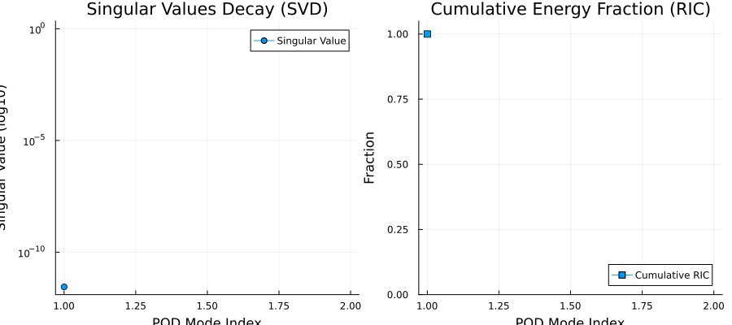

# ROM 構築・学習および検証結果の可視化レポート (Workspace)

---

## 1. LHSサンプリング時の材料・温度スナップショット

FVMシミュレーションを実行して得られた、初期スナップショット（パラメータ $\mu_1 = [0.2, 0.3, 0.4, 0.5]$）の $Z = 0.33\text{mm}$ におけるXY断面プロットです。温度スケールを $300\text{K} - 360\text{K}$ に固定して出力しています。

* **左側 (Geometry ID)**: 設計パラメータから生成された TSV や各種材料の 2D 配置。
* **右側 (Temperature)**: FVMによって解かれた定常温度場（固定カラーバー）。

---

## 2. SVD (特異値分解) の減衰と累積寄与率 (RIC)

スナップショット行列から空間的な優位モードを抽出した際の、特異値の減衰推移（左）と累積寄与率（右）です。

* **左側 (Singular Values Decay)**: 特異値がインデックスの増加に伴い対数スケールで減衰する様子。
* **右側 (Cumulative RIC)**: モード数に対する累積寄与率（今回の極小モデルでは 1 モードで 99.9% 以上のエネルギーを表現可能）。

---

## 3. FVM 厳密解 vs ROM 予測解の比較検証

未学習のテストパラメータ $\mu_{\text{test}} = [0.3, 0.4, 0.5, 0.6]$ に対する、FVMの厳密数値解（左）と、学習済み RBF-ROM による予測解（中）、および両者の絶対誤差分布（右）の比較です。

* **左側 (FVM Reference)**: FVMを実際に走らせて得られた厳密な温度分布（$T_{\text{max}} \approx 353.1\text{K}$）。
* **中央 (ROM Predicted)**: ROMが一瞬で予測・再構成した温度分布（$T_{\text{max}} \approx 353.1\text{K}$）。
* **右側 (Absolute Error)**: 二つの分布の絶対誤差マップ。誤差が $0.0\text{K}$ に極めて近く、ROMが高精度に学習できていることが分かります。
