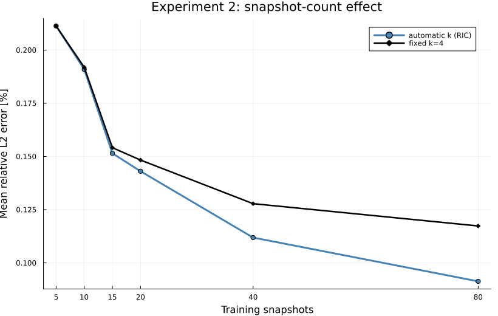
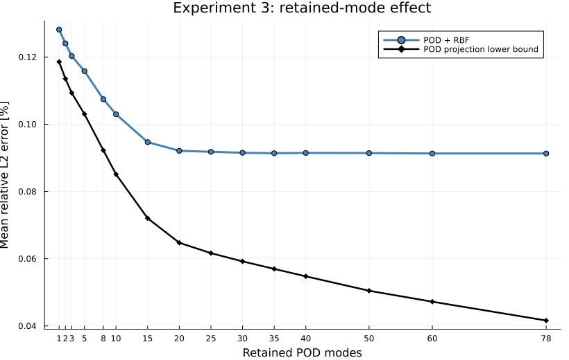
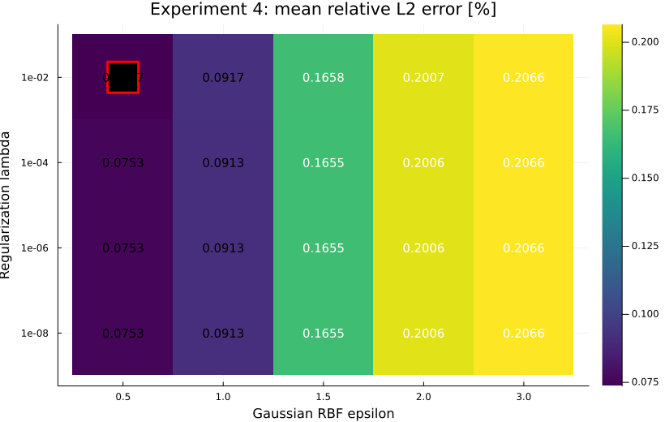

<!-- _class: lead -->

# TSV密度マップを用いた ROM性能評価

## 入力・配置・学習データ・POD・RBF条件の比較

実験2–4：240×240×30格子による正式split再評価

2026年8月6日

<!--
対象は3D-IC熱伝導FVMとPOD–Gaussian RBF ROM。保存結果の監査後に実験1A、1B、2、3、4を再計算・再作図した。
-->

---

# ROM性能に影響する5条件の比較実験

<ul class="experiment-index">
  <li><strong>実験1A｜ROM入力解像度</strong>同じTSV配置・温度場を、異なる密度マップ解像度で学習する。</li>
  <li><strong>実験1B｜TSV配置生成解像度</strong>同じ基礎密度分布から解像度別にTSVを再配置し、温度場を比較する。</li>
  <li><strong>実験2｜snapshot数</strong>モデル作成に使う温度場データ数を変え、ROM精度への影響を調べる。</li>
  <li><strong>実験3｜PODモード数</strong>保持する温度場基底数を変え、POD表現とRBF予測の制約を分ける。</li>
  <li><strong>実験4｜RBFパラメータ</strong>Gaussian RBFの ε・λを変え、L2誤差が小さい条件を探す。</li>
</ul>

実験1A：旧60×60×30格子／実験1B：探索的240×240×30格子／実験2–4：新240×240×30格子。由来の異なる誤差値は直接比較しない。

<!--
各実験は結果スライド冒頭の「実験」欄で比較方法を説明する。snapshotはFVMで得た温度場データを指す。
-->

---

# FVM・物理条件と結果の位置づけ

  

    <h2>全実験で共通</h2>
    <table>
      <tbody>
        <tr><th>計算領域</th><td>1.2 × 1.2 × 0.6 mm</td></tr>
        <tr><th>解析</th><td>3次元・定常熱伝導、逐次実行</td></tr>
        <tr><th>Z格子</th><td>H2-main由来の非一様30セル</td></tr>
        <tr><th>解法</th><td>PBiCGSTAB＋Gauss–Seidel</td></tr>
        <tr><th>収束</th><td>許容値 1×10⁻⁴、最大8,000反復</td></tr>
        <tr><th>境界条件</th><td>下面300 K固定、上面・側面は自然対流 h=5 W/(m²K)、周囲300 K</td></tr>
        <tr><th>TSV</th><td>銅、直径40 µm、高さ100 µm</td></tr>
        <tr><th>主要熱伝導率</th><td>Cu 386、Si 149、Solder 50、Resin 1.5 [W/(m·K)]</td></tr>
      </tbody>
    </table>
  

  

    <h2>実験群で異なる条件</h2>
    <table>
      <thead><tr><th>項目</th><th>1A（旧）</th><th>1B（探索）</th><th>2–4（新）</th></tr></thead>
      <tbody>
        <tr><td>XY格子</td><td>60×60</td><td>240×240</td><td>240×240</td></tr>
        <tr><td>XYセル幅</td><td>20 µm</td><td>5 µm</td><td>5 µm</td></tr>
        <tr><td>保存配列</td><td>62×62×32</td><td>242×242×32</td><td>242×242×32</td></tr>
        <tr><td>TSV本数</td><td>40–48本</td><td>16本固定</td><td>40–112本</td></tr>
        <tr><td>最小ピッチ</td><td>80 µm</td><td><strong>50 µm</strong></td><td>80 µm</td></tr>
        <tr><td>位置づけ</td><td>ROM予備評価</td><td>配置感度の探索</td><td>正式split評価</td></tr>
      </tbody>
    </table>
  

実験2–4はtrain 80件で構築しvalidation 10件で設定比較。test 10件は設定選択に未使用。1Bは50 µmピッチの探索的結果。

<!--
保存配列は各方向にghost cellを1層ずつ含む。configのlayers.divisions合計と異なり、実ソルバーはH2-main由来の固定30セルをZ方向に生成する。その他の熱伝導率：基板0.4、heatsink 222 W/(m·K)。発熱領域は各Si層4個、計12個、各0.2×0.2 mm・厚さ5 µm、1.6×10^11 W/m^3、理想総発熱量約0.384 W。シリコンは0.1–1.1 mmの矩形モデル。
-->

---

# 実験1Aと1Bの違い

| 項目 | 実験1A | 実験1B |
|---|---|---|
| 出発点 | 実際のTSV座標 | 16×16二値パターン |
| 解像度変更 | 座標を密度マップへ集計する解像度 | TSV座標を生成する格子解像度 |
| TSV物理座標 | 同じ | 解像度ごとに変わる |
| FVM温度場 | 同じ | 解像度ごとに再計算 |
| 比較対象 | ROM予測誤差 | 物理配置距離とFVM温度場差 |
| 確認すること | ROM入力表現に必要な解像度 | 配置生成格子を粗くした影響 |

実験1Aでは、TSV物理座標・FVM温度場・POD基底を固定し、ROM入力パラメータの解像度だけを変えることで、入力解像度がROM予測精度へ与える影響を調べる。実験1Bでは、同じ基礎密度パターンとTSV総数から解像度ごとに物理配置を再生成し、FVM温度場を再計算することで、配置生成格子の解像度がTSV配置と熱性能へ与える影響を調べる。

実験1AのTSV座標は保存case configから再構成。1Aは入力表現、1Bは物理配置生成への影響を評価する。

<!--
1AではケースごとのTSV物理座標とFVM温度場を固定し、入力符号化だけを変える。1Bでは同じ基礎パターンから解像度ごとにTSV座標を再生成し、FVMも再実行する。
-->

---
<!-- _class: result exp1a-result -->

# 実験1A：ROM入力解像度別の予測誤差

  

    
  

  

    
<strong>実験</strong> 同じTSV配置・FVM温度場を使い、ROM入力だけを2×2、4×4、8×8、16×16で表現して各ROMを構築。追加の同じ10ケースでL2誤差を比較。

    
<strong>横軸</strong>：密度マップ解像度 <strong>縦軸</strong>：絶対温度基準L2誤差 [%]（対数軸）

    
100 × √Σᵢ(Tᴿᴼᴹᵢ−Tᶠⱽᴹᵢ)² 　　　÷ √Σᵢ(Tᶠⱽᴹᵢ)²

    
<strong>●</strong>：設定比較用の各ケース <strong>×</strong>：入力値の一部がモデル作成用データの範囲外 <strong>青線／黒線</strong>：平均／中央値

  

L2は保存温度配列全体（ghost cellを含む）で計算。TSV配置自体やFVM格子の妥当性は、この実験から判断できない。

<!--
4×4の平均L2は0.07651%で最小。2×2は0.43353%、8×8は0.09686%、16×16は0.09706%。結論は固定した物理形状のROM入力表現に限定する。
-->

---
<!-- _class: result exp1b-result -->

# 実験1B：配置距離と温度場差の比較

  

    
  

  

    
<strong>実験</strong> 同じ基礎密度分布20種類を2×2、4×4、8×8、16×16の配置生成格子で表現。各条件で16本のTSVを再配置してFVMを実行し、16×16基準との差を比較。

    
<strong>横軸</strong>：16×16高解像度基準からのTSV配置距離 [µm] <strong>縦軸</strong>：同基準との温度場L2差 [%]

    
100 × √Σᵢ(Tᵍᵢ−T¹⁶ᵢ)² 　　　÷ √Σᵢ(T¹⁶ᵢ)²

    
<strong>●</strong>：各基礎密度分布 <strong>青／橙／緑</strong>：2×2／4×4／8×8

    
<strong>相関</strong>：Pearson r = 0.944 20種類×3粗視化条件＝60点

  

16×16は物理的な真値ではなく高解像度の比較基準。既存1Bは最小ピッチ50 µmの探索的結果。

<!--
平均では粗いほど配置距離と温度場差が増えた。相関は60点をまとめた記述値で、因果効果や統計的有意性を示さない。master単位ではChamfer距離の単調関係が19/20、温度場L2差が18/20で成立した。
-->

---
<!-- _class: result exp2-result -->

# 実験2：snapshot数別の予測誤差

  

    
  

  

    
<strong>実験</strong> train 80ケースから5、10、15、20、40、80ケースを使用し、各条件でPODとRBFを再構築。共通のvalidation 10ケースで平均L2ノルム誤差を比較。

    
<strong>横軸</strong>：モデル作成に使用したtrain snapshot数 <strong>縦軸</strong>：validation 10ケースの平均L2ノルム誤差 [%]

    
100 × √Σᵢ(Tᴿᴼᴹᵢ−Tᶠⱽᴹᵢ)² 　　　÷ √Σᵢ(Tᶠⱽᴹᵢ)²

    
<strong>青●</strong>：RIC 99.99%以上となるPODモード数を自動選択 <strong>黒◆</strong>：全条件を4モードに固定

    
<strong>比較</strong> 5→80ケースの相対改善：自動POD 56.8%、固定4モード 44.5%

  

各snapshot数は先頭Nケースの単一系列。自動PODの改善にはsnapshot追加とPODモード増加の両方が含まれる。

<!--
自動POD曲線の改善にはデータ追加だけでなくモード数増加が含まれる。80ケースではvalidation 10ケースすべてが、各入力値についてtrainデータの最小～最大範囲内だった。
-->

---
<!-- _class: result exp3-result -->

# 実験3：PODモード数別の予測誤差

  

    
  

  

    
<strong>実験</strong> train 80ケースから共通POD基底を作り、保持モード数を1～78へ変更。各条件でRBFを再構築し、validation 10ケースを評価。

    
<strong>横軸</strong>：保持したPODモード数 <strong>縦軸</strong>：validation 10ケースの平均L2ノルム誤差 [%]

    
100 × √Σᵢ(Tᵖʳᵉᵈᵢ−Tᶠⱽᴹᵢ)² 　　　÷ √Σᵢ(Tᶠⱽᴹᵢ)²

    
<strong>青●</strong>：密度マップからRBFでPOD係数を予測したROM誤差 <strong>黒◆</strong>：正解温度場をPOD基底へ直接射影した表現下限

    
<strong>結果</strong> 青線は20モード以降約0.091%で横ばい。黒線だけが低下し、RBF係数予測との差が拡大。

  

ROM予測の最小平均L2：60モードで0.09130%。78モードのPOD射影下限：0.04160%。

<!--
高モード域ではPOD基底不足より、入力からPOD係数を求めるRBF補間が主要制約。温度場L2の改善は最大温度精度の改善を保証しない。
-->

---
<!-- _class: result exp4-result -->

# 実験4：RBFパラメータ別の予測誤差

  

    
  

  

    
<strong>実験</strong> PODを78モードに固定し、Gaussian RBFのepsilon 5値×lambda 4値＝20条件を構築。validation 10ケースで評価。

    
<strong>横軸</strong>：Gaussian形状パラメータ ε <strong>縦軸</strong>：Ridge正則化パラメータ λ <strong>色・数値</strong>：validation 10ケースの平均L2ノルム誤差 [%]（小さいほど良い）

    
φ(r) = exp[−(εr)²] Φᵢⱼ = exp[−(ε‖μᵢ−μⱼ‖₂)²] (Φ + λI)W = A

    
<strong>ε</strong>：小さいほど広く滑らかな基底、大きいほど局所的な基底。 <strong>λ</strong>：係数の過大化を抑え、計算を安定化する正則化。

    
<strong>結果</strong> <strong>赤枠</strong>の ε=0.5、λ=10⁻² が最小で、平均L2誤差は <strong>0.07367%</strong>。

  

validation 10ケースで条件を選択。採用条件の最終性能は、設定選択に未使用のtest 10ケースで確認する。

<!--
同じepsilonでもlambdaによって誤差が変わるため、基底の広がりと正則化を組み合わせて選ぶ必要がある。
-->

---

# 補足：Gaussian RBFによる温度場予測

  

    <h2>どうやって予測するか</h2>
    
<strong>RBF</strong>は、入力間の距離だけで類似度を決める補間法。<strong>Gaussian</strong>は、距離 <em>r</em> に対して次の類似度を用いる。

    
φ(r)=exp[−(εr)²]

    <ol>
      <li>新しい密度マップ μ* と、80個のtrain入力 μⱼ の距離を計算</li>
      <li>距離に応じた重みで、78個のPOD係数 a(μ*) を予測</li>
      <li>POD基底 U を合成し、温度場を再構成</li>
    </ol>
    
(Φ+λI)W=A　［モデル構築］ a(μ*)=k(μ*)ᵀW　［係数予測］ Tᴿᴼᴹ(μ*)=T̄+Ua(μ*)　［温度場再構成］

  

  

    <h2>パラメータを変えると</h2>
    

<strong>ε：基底の広がり</strong> 小さい → 広く滑らか。多くの入力を参照 大きい → 狭く局所的。近い入力を重視 極端に小さいと差を表しにくく、大きいと入力間で不安定になりやすい。

    

<strong>λ：Ridge正則化</strong> 小さい → モデル作成用データへ密着 大きい → 重みを抑え、安定・滑らか 大きすぎると予測が平均化され、個別の変化を捉えにくい。

    
<strong>実験4</strong>では、εとλの組合せを変え、滑らかさとデータ適合のバランスを比較した。

  

