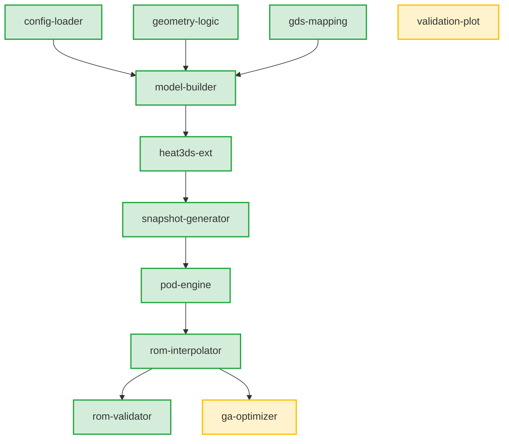

# システム仕様・進捗状況ダッシュボード (System Specification & Progress Dashboard)

本プロジェクト（3D-IC熱最適化システム）を構成する各モジュール（仕様）の役割、および現在の実装状況（実装済み / 未実装）の一覧です。

---

## 1. コンポーネント一覧と進捗状況

| コンポーネント名 | 主な役割 | 進捗状況 | 関連ファイルへのリンク |
| :--- | :--- | :---: | :--- |
| **`config-loader`** | 設定 JSON ファイルの パース、バリデーション、およびシステム共通設定オブジェクトの生成。 | 🟢 **実装完了** | [spec](file:///home/somadwsl/somad_dev3/.kiro/specs/config-loader/requirements.md) / [tasks](file:///home/somadwsl/somad_dev3/.kiro/specs/config-loader/tasks.md) |
| **`component-generator`** | 各種デバイス構造（TSV、熱源、はんだなど）の配置パラメータの生成と、FVM用グリッド割り当てロジック。 | 🟢 **実装完了** | [spec](file:///home/somadwsl/somad_dev3/.kiro/specs/component-generator/requirements.md) / [tasks](file:///home/somadwsl/somad_dev3/.kiro/specs/component-generator/tasks.md) |
| **`geometry-logic`** | 各セル重心がプリミティブ（直方体・円柱・球）に含まれるかどうかの幾何判定と、BBoxによる早期棄却による高速化。 | 🟢 **実装完了** | [spec](file:///home/somadwsl/somad_dev3/.kiro/specs/geometry-logic/requirements.md) / [tasks](file:///home/somadwsl/somad_dev3/.kiro/specs/geometry-logic/tasks.md) |
| **`gds-mapping`** | GDSIIレイヤーからのレイアウト（多角形ポリゴン）の読み込み、およびチップ座標系へのマッピングと包含判定。 | 🟢 **実装完了** | [spec](file:///home/somadwsl/somad_dev3/.kiro/specs/gds-mapping/requirements.md) / [tasks](file:///home/somadwsl/somad_dev3/.kiro/specs/gds-mapping/tasks.md) |
| **`model-builder`** | 3D解析グリッドの自動生成、材料IDマップ（ID-map）の充填、および物性値（熱伝導率等）の格子へのマッピング。 | 🟢 **実装完了** | [spec](file:///home/somadwsl/somad_dev3/.kiro/specs/model-builder/requirements.md) / [tasks](file:///home/somadwsl/somad_dev3/.kiro/specs/model-builder/tasks.md) |
| **`heat3ds-ext`** | 3次元FVMシミュレータ `heat3ds.jl` の拡張。設計パラメータ `mu` の受け取りと、結果の自動 JLD2 保存機能。 | 🟢 **実装完了** | [spec](file:///home/somadwsl/somad_dev3/.kiro/specs/heat3ds-ext/requirements.md) / [tasks](file:///home/somadwsl/somad_dev3/.kiro/specs/heat3ds-ext/tasks.md) |
| **`snapshot-generator`** | 密度マップのサンプリング（LHS等）および、制約（総TSV本数等）の検証を行った上でのFVM一括実行自動制御。 | 🟢 **実装完了** | [spec](file:///home/somadwsl/somad_dev3/.kiro/specs/snapshot-generator/requirements.md) / [tasks](file:///home/somadwsl/somad_dev3/.kiro/specs/snapshot-generator/tasks.md) |
| **`pod-engine`** | スナップショット行列の構築、SVD（特異値分解）による空間基底（PODモード）抽出、およびRIC寄与率に基づく次元削減。 | 🟢 **実装完了** | [spec](file:///home/somadwsl/somad_dev3/.kiro/specs/pod-engine/requirements.md) / [tasks](file:///home/somadwsl/somad_dev3/.kiro/specs/pod-engine/tasks.md) |
| **`rom-interpolator`** | POD係数と密度マップ `mu` を紐付ける RBF 補間モデルの構築・学習・予測・保存、および温度場の3D再構成。 | 🟢 **実装完了** | [spec](file:///home/somadwsl/somad_dev3/.kiro/specs/rom-interpolator/requirements.md) / [tasks](file:///home/somadwsl/somad_dev3/.kiro/specs/rom-interpolator/tasks.md) |
| **`rom-validator`** | 未学習データに対する予測誤差（L2、Tmax、幾何位置）算出、合否判定、および統一断面比較プロット・レポート生成。 | 🟢 **実装完了** | [spec](file:///home/somadwsl/somad_dev3/.kiro/specs/rom-validator/requirements.md) / [tasks](file:///home/somadwsl/somad_dev3/.kiro/specs/rom-validator/tasks.md) |
| **`validation-plot`** | 最適化された密度マップや、実座標に展開されたTSV配置のレイアウトなどを可視化する個別プロット機能。 | 🟡 開発中 | [spec](file:///home/somadwsl/somad_dev3/.kiro/specs/validation-plot/requirements.md) / [tasks](file:///home/somadwsl/somad_dev3/.kiro/specs/validation-plot/tasks.md) |
| **`ga-optimizer`** | 遺伝的アルゴリズムによる最適密度マップ探索。交叉・突然変異、制約修正、ROM高速評価、外挿検知、FVM再検証を含む。 | 🟡 開発中 | [spec](file:///home/somadwsl/somad_dev3/.kiro/specs/ga-optimizer/requirements.md) / [tasks](file:///home/somadwsl/somad_dev3/.kiro/specs/ga-optimizer/tasks.md) |

---

## 2. 開発優先度とロードマップ

[実装状況と要件差分.md](file:///home/somadwsl/somad_dev3/%E5%AE%9F%E8%A3%85%E7%8A%B6%E6%B3%81%E3%81%A8%E8%A6%81%E4%BB%B6%E5%B7%AE%E5%88%86.md) に示されている推奨順序に沿うと、残りの開発ステップは以下の通りです。

1. **FVM入力生成側の拡張 (前処理)**
   * `config-loader`, `geometry-logic`, `model-builder`, `heat3ds-ext` を完成させ、密度マップ情報から動的に実TSV円柱IDマップを再構築してFVMに流し込む流れを作ります。
2. **スナップショット自動生成の実行**
   * `snapshot-generator` を完成させ、密度マップ `mu` をランダム生成してFVMシミュレーションをループ実行し、データセットを蓄積します。
3. **GA最適化の実装**
   * すでに完成した `pod-engine`, `rom-interpolator`, `rom-validator` のROM基盤を活用し、`ga-optimizer` を構築して探索エンジンを動かします。
